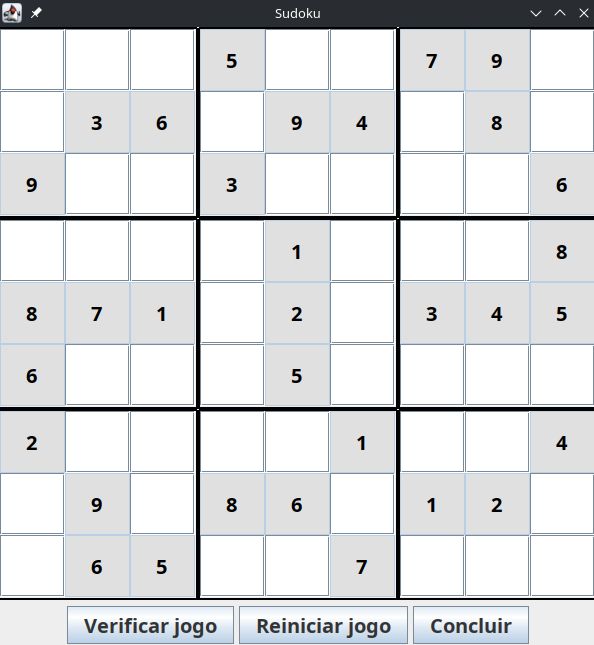

# Sudoku (Java + Swing)

Jogo de Sudoku em Java, com interface gráfica construída em Swing. O tabuleiro é configurável externamente através de um arquivo de texto, sem necessidade de recompilar a aplicação para jogar um Sudoku diferente.

> 📓 Este projeto tem um **[LOG de desenvolvimento completo](docs/log_de_desenvolvimento.md)**, documentando, etapa por etapa, cada decisão de design tomada durante a construção, incluindo os motivos técnicos por trás de cada classe criada, os bugs encontrados no caminho e como foram resolvidos, e a decisão consciente de onde o escopo do projeto foi encerrado.

<p align="center">
  
</p>

## Sobre o projeto

A aplicação exibe um tabuleiro de Sudoku 9x9, com as posições fixas (dicas) protegidas contra edição e destacadas visualmente (fundo cinza, texto em negrito). O jogador preenche as posições livres, podendo a qualquer momento verificar o status do jogo, reiniciar o progresso ou concluir a partida.

O tabuleiro inicial (quais posições são fixas e quais são os valores corretos esperados) não é fixo no código: é lido de um arquivo de texto externo, informado como argumento de execução.

## Como executar

### Pré-requisitos

- JDK 21 ou superior.

### Compilando e executando

1. Clone o repositório.
2. Compile o projeto (via IDE de sua preferência, ou `javac`).
3. Crie ou utilize um arquivo `.txt` com a configuração do tabuleiro (veja o formato abaixo, ou use o arquivo de exemplo `sudoku.txt` incluído no repositório).
4. Execute a classe `com.github.ahaerdy.Main`, passando o caminho do arquivo como **único argumento de linha de comando**. Exemplo:

```
java com.github.ahaerdy.Main sudoku.txt
```

Se estiver rodando pela IntelliJ IDEA, configure o campo **Program arguments** da sua Run Configuration com o nome (ou caminho) do arquivo — por exemplo, `sudoku.txt`, se o arquivo estiver na raiz configurada como **Working directory**.

### Formato do arquivo de configuração

O arquivo contém 81 entradas — uma para cada posição do tabuleiro —, separadas por espaço em branco (espaço simples ou quebra de linha, ambos são aceitos). Cada entrada segue o formato:

```
coluna,linha;valorEsperado,éFixo
```

- `coluna` e `linha`: coordenadas da posição, de `0` a `8`.
- `valorEsperado`: o número correto daquela posição (de `1` a `9`).
- `éFixo`: `true` se a posição já vem preenchida como dica (não editável pelo jogador), `false` se a posição deve começar vazia.

Exemplo de uma única entrada: `3,5;7,true` — significa "na coluna 3, linha 5, o valor correto é 7, e essa posição é uma dica fixa".

O arquivo pode conter todas as 81 entradas em uma única linha ou distribuídas em várias linhas (por exemplo, uma linha do Sudoku por linha do arquivo) — os dois formatos são interpretados da mesma forma.

## Funcionalidades

- **Tabuleiro configurável externamente**, via arquivo de texto, sem necessidade de recompilação.
- **Validação de entrada**: cada célula aceita apenas um único dígito de 1 a 9.
- **Proteção de posições fixas**: dicas do jogo não podem ser editadas, e são destacadas visualmente (fundo cinza, texto em negrito) para diferenciação clara das posições livres.
- **Verificação de status**: um botão exibe se o jogo está não iniciado, incompleto ou completo, e se contém erros.
- **Reinício com confirmação**: reinicia o progresso do jogador (preservando as dicas fixas), mediante confirmação explícita.
- **Conclusão de partida**: verifica se o tabuleiro está completo e correto, exibindo mensagem de sucesso quando for o caso.
- **Interface sempre sincronizada com o estado do jogo**, inclusive após ações programáticas como o reinício.

## Arquitetura

O projeto é organizado em três pacotes, com responsabilidades bem delimitadas:

```
com.github.ahaerdy
├── Main.java                    — ponto de entrada único da aplicação
├── model
│   ├── Space.java                — uma célula do tabuleiro (valor atual, valor esperado, se é fixa)
│   ├── Board.java                — o tabuleiro completo e as regras do jogo
│   └── GameStatusEnum.java       — os três estados possíveis do jogo
├── service
│   ├── EventEnum.java            — tipos de evento do sistema de notificação
│   ├── EventListener.java        — contrato para componentes que reagem a eventos
│   └── NotifierService.java      — publica eventos para os componentes inscritos
└── ui.custom
    ├── input
    │   ├── NumberText.java        — campo de texto de uma célula (visual + sincronização com Space)
    │   └── NumberTextLimit.java   — restringe a digitação a um único dígito de 1 a 9
    └── panel
        └── SudokuSector.java      — agrupamento visual de um bloco 3x3
```

### Separação entre domínio e interface

As classes do pacote `model` (`Space`, `Board`, `GameStatusEnum`) não têm nenhuma dependência de Swing ou de qualquer detalhe de interface gráfica — elas representam as regras do Sudoku de forma isolada e poderiam, em princípio, ser reaproveitadas por qualquer outra forma de interação (uma API web, um menu de texto, um teste automatizado) sem alteração.

### Sincronização entre tela e domínio

Quando uma ação programática altera o estado do jogo — por exemplo, o botão de reiniciar limpando todas as células não fixas —, os componentes visuais (`NumberText`) precisam ser avisados dessa mudança para refletir o novo estado na tela. Isso é resolvido com uma implementação do padrão **Observer**: cada `NumberText`, ao ser criado, se inscreve no `NotifierService` para o evento `CLEAR_SPACE`; quando o botão de reiniciar é acionado, o `NotifierService` notifica todos os campos inscritos, que então se atualizam visualmente.

### Decisões de escopo

Duas extensões foram consideradas durante o desenvolvimento e deliberadamente não implementadas nesta versão:

- **Uma camada de serviço** intermediando a leitura de configuração e a montagem do domínio — avaliada como prematura, já que o `Main` atual permanece legível e não há, neste projeto, um segundo consumidor concreto que se beneficiaria dessa separação.
- **Um segundo modo de interação (texto/console)** — fora do escopo definido para esta prova de conceito, que é deliberadamente focada em interface gráfica.

O raciocínio completo por trás dessas duas decisões está detalhado no [LOG de desenvolvimento](docs/log_de_desenvolvimento.md).

## Stack

- **Linguagem:** Java 21
- **Interface gráfica:** Swing (biblioteca padrão do Java)
- **Dependências externas:** nenhuma

## Estrutura do repositório

```
.
├── src/                              — código-fonte do projeto
├── sudoku.txt                        — arquivo de exemplo com um Sudoku válido completo
├── docs/
│   └── log_de_desenvolvimento.md     — registro cronológico das decisões de desenvolvimento
└── README.md
```
