# LOG de Desenvolvimento: Sudoku em Java

## Sobre este Projeto

Jogo de Sudoku implementado em Java, com duas formas de execução: uma pela linha de comando (modo texto) e outra com interface gráfica (Swing). As duas compartilham exatamente as mesmas regras de jogo, sem duplicação de lógica entre os modos.

Este documento é o registro cronológico das decisões tomadas ao longo da construção do projeto: o que foi implementado, os motivos de cada escolha e os problemas concretos que motivaram cada mudança de estrutura no código. A leitura sequencial deste LOG permite acompanhar o raciocínio de engenharia por trás do projeto, não apenas o resultado final.

## Stack Utilizada

- **Linguagem:** Java 21
- **Interface gráfica:** Swing (biblioteca padrão do Java)
- **IDE:** IntelliJ IDEA
- *(demais dependências e ferramentas serão listadas conforme forem incorporadas ao projeto)*

## Estrutura deste LOG

Cada entrada corresponde a um momento de evolução real do código, geralmente motivado por algo identificado durante a implementação: uma repetição desnecessária, um comportamento inesperado em teste, ou uma necessidade nova surgida no percurso. As entradas são cumulativas: decisões registradas em uma entrada permanecem válidas (ou são explicitamente revistas) nas entradas seguintes.

---

## Índice

- [Entrada 0: Configuração Inicial do Projeto](#entrada-0-configuração-inicial-do-projeto)
- [Parte 0: Exibição Inicial da Janela](#parte-0-exibição-inicial-da-janela)
- [Parte 1: Construção da Grade 9x9](#parte-1-construção-da-grade-9x9)
- [Parte 2: Preenchimento Manual dos Valores Fixos](#parte-2-preenchimento-manual-dos-valores-fixos)
- [Parte 3: Arrays Paralelos para Valor Esperado e Status Fixo](#parte-3-arrays-paralelos-para-valor-esperado-e-status-fixo)
- [Parte 4: Extração da Classe Space](#parte-4-extração-da-classe-space)
- [Parte 5: Restrição de Digitação e Sincronização com o Space](#parte-5-restrição-de-digitação-e-sincronização-com-o-space)
- [Parte 6: Organização Visual em Blocos 3x3](#parte-6-organização-visual-em-blocos-3x3)
- [Parte 7: Botão de Verificação do Jogo](#parte-7-botão-de-verificação-do-jogo)
- [Parte 8: Extração de Board e GameStatusEnum](#parte-8-extração-de-board-e-gamestatusenum)
- [Parte 9: Botões de Reiniciar e Concluir](#parte-9-botões-de-reiniciar-e-concluir)
- [Parte 10: Sincronização entre Tela e Domínio (Padrão Observer)](#parte-10-sincronização-entre-tela-e-domínio-padrão-observer)
- [Parte 11: Configuração do Tabuleiro via Arquivo Externo](#parte-11-configuração-do-tabuleiro-via-arquivo-externo)

---

## Entrada 0: Configuração Inicial do Projeto

**Data:** 11/09/2026

**Objetivo:** desenvolver um Sudoku jogável, validando primeiro a mecânica do jogo na prática e, em seguida, expandindo os detalhes de interface.

Decisões tomadas antes do início da implementação:

- O desenvolvimento parte da interface gráfica. A prioridade é ter algo visível e interativo o quanto antes, mesmo sem nenhuma regra de jogo implementada. As regras serão incorporadas conforme se tornarem necessárias.
- Ambiente: projeto Java criado no IntelliJ IDEA, JDK 21, pacote base `com.github.ahaerdy`.
- Sem dependências externas no momento; utilização apenas da biblioteca padrão do Java.

Repositório criado. Registro da próxima entrada previsto para a primeira execução funcional em tela.

---

### Rascunho Inicial

A abordagem adotada neste desenvolvimento baseia-se nos princípios do Design Emergente, onde a complexidade do software cresce de maneira guiada pelo comportamento visual e funcional desejado.

<p align="center">
  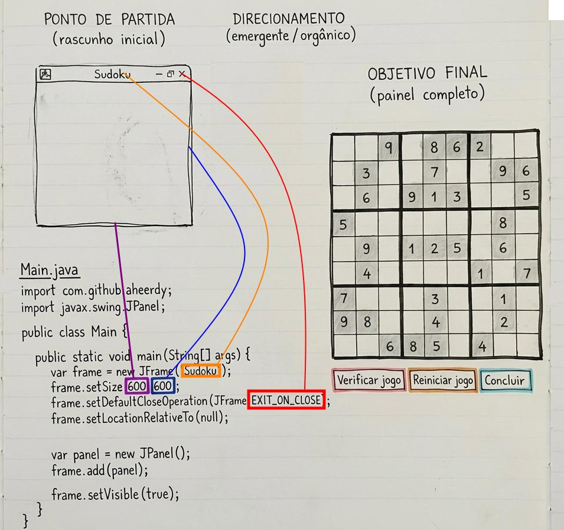
</p>

Como ilustrado no esboço, o ponto de partida consiste em uma casca vazia (`Main.java` instanciando um `JFrame` e `JPanel` fundamentais), estabelecendo os requisitos básicos de exibição. O objetivo final define os limites do domínio do problema (o tabuleiro funcional de Sudoku). As etapas a seguir (Partes 00 a 10) demonstram o passo a passo da transição desse rascunho inicial até a entrega do sistema completo, destacando a criação orgânica das classes e componentes Swing.

---

## Parte 0: Exibição Inicial da Janela

### Objetivo

Validar o ambiente de desenvolvimento por meio da exibição de uma janela gráfica, sem qualquer regra de jogo ou classe de domínio envolvida. Trata-se da forma mais rápida de confirmar que o ambiente Swing está configurado corretamente.

### Implementação Realizada

- Criação, dentro de `src`, exclusivamente do pacote `com.github.ahaerdy`.
- Criação da classe `Main`, que atuará inicialmente como o único ponto de entrada do projeto (esse detalhe será relevante em etapas posteriores).
- Implementação do código mínimo necessário para exibir uma janela Swing vazia.

### Código

```java
package com.github.ahaerdy;

import javax.swing.JFrame;
import javax.swing.JPanel;

public class Main {

    public static void main(String[] args) {
        var frame = new JFrame("Sudoku");
        frame.setSize(600, 600);
        frame.setDefaultCloseOperation(JFrame.EXIT_ON_CLOSE);
        frame.setLocationRelativeTo(null);

        var panel = new JPanel();
        frame.add(panel);

        frame.setVisible(true);
    }

}
```

### Descrição Técnica

- `new JFrame("Sudoku")`: cria a janela, com o texto "Sudoku" na barra de título.
- `setSize(600, 600)`: define o tamanho inicial da janela em pixels.
- `setDefaultCloseOperation(JFrame.EXIT_ON_CLOSE)`: define que, ao fechar a janela pelo "X", o programa é encerrado.
- `setLocationRelativeTo(null)`: centraliza a janela na tela.
- `var panel = new JPanel()`: cria um painel vazio, que servirá de contêiner para as células do Sudoku em etapas futuras.
- `frame.add(panel)`: adiciona o painel à janela.
- `setVisible(true)`: torna a janela efetivamente visível. Sem essa chamada, a janela não é exibida.

Todo o código está contido em um único método `main`, sem classes adicionais. Essa escolha é deliberada: nesta etapa ainda não há informação suficiente sobre o problema para justificar a separação de responsabilidades. Introduzir camadas ou classes antecipadamente, sem uma necessidade concreta, seria antecipar uma decisão de design sem base para sustentá-la.

### Glossário

| Termo | Significado |
|---|---|
| **`JFrame`** | Classe do Swing que representa a janela de uma aplicação desktop. |
| **`JPanel`** | Contêiner do Swing usado para agrupar outros componentes visuais. |
| **`setDefaultCloseOperation`** | Define o comportamento do programa ao fechar a janela. |
| **`setVisible(true)`** | Torna a janela (ou componente) efetivamente visível na tela. |

### Resultado

Execução de `Main` concluída com sucesso: exibição de uma janela, vazia, de 600x600 pixels, com o título "Sudoku", centralizada na tela. O fechamento da janela encerra o programa, conforme esperado.

<p align="center">
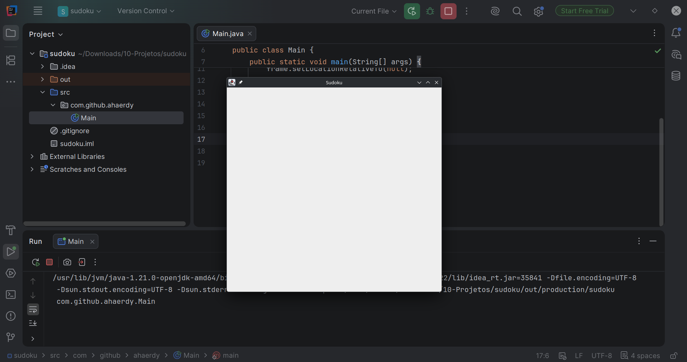
</p>

### Esquema de Implementação

<p align="center">
  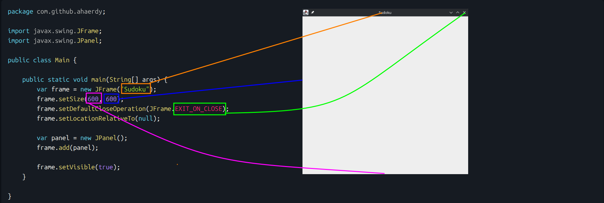
</p>

---

## Parte 1: Construção da Grade 9x9

**Data:** 11/09/2026

### Objetivo

Com a janela já funcional, o passo seguinte consiste em exibir as 81 células do Sudoku. Nesta etapa, a atenção está voltada exclusivamente ao layout visual, sem qualquer preocupação com regras ou valores numéricos.

### Implementação Realizada

- Substituição do painel vazio por um painel organizado em grade, com 9 linhas e 9 colunas.
- Preenchimento da grade com 81 campos de texto, por meio de um laço de repetição duplo.

### Código

```java
package com.github.ahaerdy;

import javax.swing.JFrame;
import javax.swing.JPanel;
import javax.swing.JTextField;
import java.awt.GridLayout;

public class Main {

    public static void main(String[] args) {
        var frame = new JFrame("Sudoku");
        frame.setSize(600, 600);
        frame.setDefaultCloseOperation(JFrame.EXIT_ON_CLOSE);
        frame.setLocationRelativeTo(null);

        var panel = new JPanel();
        panel.setLayout(new GridLayout(9, 9));

        for (int linha = 0; linha < 9; linha++) {
            for (int coluna = 0; coluna < 9; coluna++) {
                var campo = new JTextField();
                panel.add(campo);
            }
        }

        frame.add(panel);
        frame.setVisible(true);
    }

}
```

### Descrição Técnica

- `panel.setLayout(new GridLayout(9, 9))`: define que o painel deve organizar automaticamente seus componentes filhos em uma grade de 9 linhas por 9 colunas, todos de tamanho igual. O `GridLayout` é responsável pelo posicionamento, dispensando o cálculo manual de coordenadas.
- O laço duplo (um `for` dentro de outro `for`) cria 81 campos de texto (`JTextField`) e adiciona cada um ao painel, um por vez. A ordem de adição determina a posição de cada campo na grade, da esquerda para a direita e de cima para baixo.
- Os campos criados não são armazenados em nenhuma estrutura própria. A variável `campo` existe apenas dentro do escopo do laço e é descartada a cada iteração. Essa limitação será tratada em uma entrada posterior, quando houver necessidade concreta de acessar campos específicos.

### Glossário

| Termo | Significado |
|---|---|
| **`GridLayout`** | Gerenciador de layout do Swing responsável por organizar componentes filhos automaticamente em linhas e colunas de tamanho igual. |
| **`JTextField`** | Componente do Swing que representa um campo de texto editável de uma linha. |
| **Laço aninhado** | Estrutura de repetição com um `for` dentro de outro, utilizada aqui para percorrer as 9 linhas e, para cada uma, as 9 colunas. |

### Resultado

Execução de `Main` concluída com sucesso: exibição da janela preenchida com 81 campos de texto vazios, organizados em uma grade uniforme de 9x9.

<p align="center">
  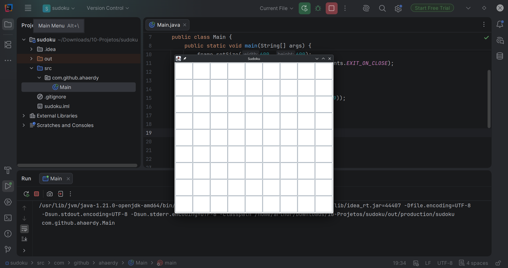
</p>

### Esquema de Implementação

<p align="center">
  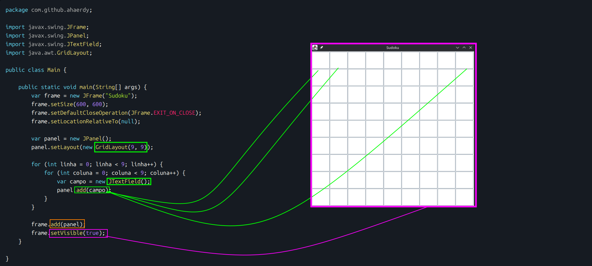
</p>

---

## Parte 2: Preenchimento Manual dos Valores Fixos

**Data:** 11/09/2026

### Objetivo

Exibir números reais na grade, representando as dicas iniciais do Sudoku. A abordagem adotada nesta etapa consiste em armazenar uma referência a cada campo de texto e preencher manualmente, com `setText(...)`, as posições conhecidas como dicas.

### Implementação Realizada

- Criação de uma matriz de referências para os 81 campos de texto, indexada por linha e coluna.
- Armazenamento de cada campo na matriz no momento de sua criação, dentro do mesmo laço que já preenchia a grade.
- Preenchimento manual de um conjunto de posições da matriz com os valores fixos do Sudoku, por meio de chamadas sucessivas a `setText(...)`.

### Código

```java
package com.github.ahaerdy;

import javax.swing.JFrame;
import javax.swing.JPanel;
import javax.swing.JTextField;
import java.awt.GridLayout;

public class Main {

    public static void main(String[] args) {
        var frame = new JFrame("Sudoku");
        frame.setSize(600, 600);
        frame.setDefaultCloseOperation(JFrame.EXIT_ON_CLOSE);
        frame.setLocationRelativeTo(null);

        var panel = new JPanel();
        panel.setLayout(new GridLayout(9, 9));

        var campos = new JTextField[9][9];
        for (int linha = 0; linha < 9; linha++) {
            for (int coluna = 0; coluna < 9; coluna++) {
                var campo = new JTextField();
                campos[linha][coluna] = campo;
                panel.add(campo);
            }
        }

        // preenchimento manual de algumas das dicas deste Sudoku
        campos[0][2].setText("9");
        campos[0][4].setText("8");
        campos[0][5].setText("6");
        campos[0][6].setText("2");
        campos[1][1].setText("3");
        campos[1][4].setText("7");
        campos[1][7].setText("9");
        campos[1][8].setText("6");
        campos[2][1].setText("6");
        campos[2][3].setText("9");
        campos[2][4].setText("1");
        campos[2][5].setText("3");
        campos[2][8].setText("5");
        // demais linhas seguem o mesmo padrão, uma para cada dica do Sudoku

        frame.add(panel);
        frame.setVisible(true);
    }

}
```

### Descrição Técnica

- `campos[linha][coluna] = campo;`: armazena a referência do campo recém-criado na posição correspondente da matriz, imediatamente após sua criação.
- Após a conclusão do laço, com os 81 campos já criados, adicionados ao painel e armazenados na matriz, torna-se possível acessar qualquer célula específica por coordenada e chamar `setText(...)` diretamente sobre ela.

### Diferença entre `var campo = new JTextField();` e `var campos = new JTextField[9][9];`

Embora ambas as declarações envolvam o tipo `JTextField`, elas cumprem papéis distintos e essa distinção é central para o funcionamento do código desta etapa.

- **Natureza da variável.** `campo` é uma referência simples, para um único objeto `JTextField` por vez. `campos` é uma matriz (array bidimensional), uma estrutura que agrupa múltiplas referências, organizadas em posições identificadas por dois índices (linha e coluna).
- **Escopo e tempo de vida.** `campo` é declarada dentro do corpo do laço `for` mais interno. Sua existência está restrita a cada iteração: a cada volta do laço, uma nova variável `campo` é criada, aponta para um novo objeto e é descartada ao final daquela iteração. `campos`, por sua vez, é declarada uma única vez, fora do laço, e permanece acessível durante toda a execução do método `main`, inclusive após o laço terminar.
- **Quantidade de objetos referenciados.** `campo` referencia um único `JTextField` a cada momento. `campos` referencia, simultaneamente, os 81 objetos `JTextField` criados ao longo do laço, um para cada célula do tabuleiro.
- **Identidade dos objetos.** Não há duplicação de objetos entre as duas variáveis. O mesmo objeto criado por `new JTextField()` e atribuído a `campo` é o mesmo objeto adicionado ao painel (`panel.add(campo)`) e o mesmo objeto armazenado em `campos[linha][coluna]`. A matriz não cria novas instâncias, apenas preserva o acesso a instâncias já existentes, que de outra forma seriam perdidas ao final de cada iteração.
- **Motivação da mudança.** Na Parte 1, os campos eram criados e adicionados ao painel, mas nenhuma referência sobrevivia ao laço, o que tornava impossível localizar uma célula específica depois de criada. A introdução de `campos` resolve exatamente essa limitação, permitindo o acesso posterior a qualquer célula pelo par (linha, coluna), como ocorre nas chamadas a `setText(...)` desta etapa.

### Observações sobre Limitações Atuais

A abordagem adotada nesta etapa apresenta pontos que já podem ser antecipados como fonte de problemas futuros, ainda que funcionais no momento:

- O preenchimento manual de cada dica exige uma linha de código por posição, o que resulta em um volume considerável de chamadas repetitivas e propensas a erro de coordenada.
- Nenhum mecanismo impede que o jogador edite ou apague um valor definido como dica. Os campos de texto permanecem totalmente editáveis.
- A substituição do Sudoku exibido exigiria reescrever manualmente todas as chamadas a `setText(...)`.

Esses pontos não serão corrigidos nesta etapa, mas ficam registrados como motivação para ajustes em entradas futuras.

### Glossário

| Termo | Significado |
|---|---|
| **Array bidimensional (matriz)** | Estrutura de tamanho fixo organizada em linhas e colunas, aqui utilizada para armazenar uma referência a cada campo de texto pelo par (linha, coluna). |
| **Referência** | Em Java, uma variável de tipo objeto não armazena o objeto em si, mas um endereço que aponta para ele. Múltiplas variáveis podem apontar para o mesmo objeto. |

### Resultado

Execução de `Main` concluída com sucesso: as dicas configuradas foram exibidas nas posições corretas da grade. Confirmou-se também que, no estado atual, é possível clicar em qualquer célula preenchida e apagar seu valor, sem qualquer restrição ou aviso. Essa limitação fica registrada para tratamento em entrada posterior.

<p align="center">
  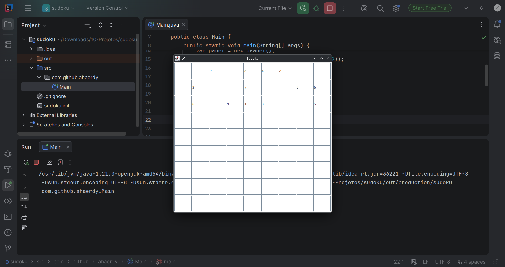
</p>

### Esquema de Implementação

<p align="center">
  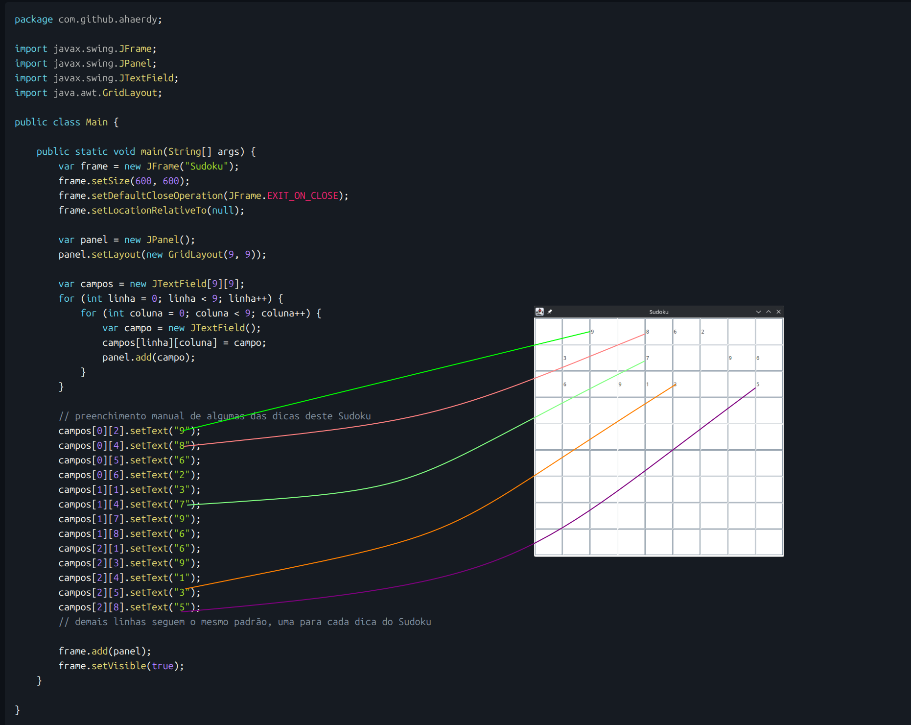
</p>

---

## Parte 3: Arrays Paralelos para Valor Esperado e Status Fixo

**Data:** 11/09/2026

### Objetivo

Resolver duas necessidades que ficaram evidentes na etapa anterior: primeiro, ter à disposição o valor correto esperado para qualquer célula do tabuleiro, não apenas para as previamente memorizadas; segundo, identificar quais células são fixas, para restringir sua edição. A solução adotada nesta etapa é a introdução de dois novos arrays, cada um alinhado por coordenada ao array de campos já existente.

### Implementação Realizada

- Criação de uma matriz `int[][] esperado`, contendo a solução completa do Sudoku exibido (todos os 81 valores corretos, não apenas os fixos).
- Criação de uma matriz `boolean[][] fixo`, do mesmo tamanho, indicando para cada posição se ela corresponde a uma dica fixa.
- Dentro do laço que cria os campos de texto, consulta a `fixo[linha][coluna]` para decidir, simultaneamente, se o campo recebe o valor esperado como texto e se sua edição deve ser restringida.

### Código

```java
package com.github.ahaerdy;

import javax.swing.JFrame;
import javax.swing.JPanel;
import javax.swing.JTextField;
import java.awt.GridLayout;

public class Main {

    public static void main(String[] args) {
        var frame = new JFrame("Sudoku");
        frame.setSize(600, 600);
        frame.setDefaultCloseOperation(JFrame.EXIT_ON_CLOSE);
        frame.setLocationRelativeTo(null);

        int[][] esperado = {
                {4, 7, 9, 5, 8, 6, 2, 3, 1},
                {1, 3, 5, 4, 7, 2, 8, 9, 6},
                {2, 6, 8, 9, 1, 3, 7, 4, 5},
                {5, 1, 3, 7, 6, 4, 9, 8, 2},
                {8, 9, 7, 1, 2, 5, 3, 6, 4},
                {6, 4, 2, 3, 9, 8, 1, 5, 7},
                {7, 5, 4, 2, 3, 9, 6, 1, 8},
                {9, 8, 1, 6, 4, 7, 5, 2, 3},
                {3, 2, 6, 8, 5, 1, 4, 7, 9}
        };

        boolean[][] fixo = {
                {false, false, true, false, true, true, true, false, false},
                {false, true, false, false, true, false, false, true, true},
                {false, true, false, true, true, true, false, false, true},
                {true, false, false, false, false, false, false, true, false},
                {false, true, false, true, true, true, false, true, false},
                {false, true, false, false, false, false, true, false, true},
                {true, false, false, false, true, false, false, true, false},
                {true, true, false, false, true, false, false, true, false},
                {false, false, true, true, true, false, true, false, false}
        };

        var panel = new JPanel();
        panel.setLayout(new GridLayout(9, 9));

        var campos = new JTextField[9][9];
        for (int linha = 0; linha < 9; linha++) {
            for (int coluna = 0; coluna < 9; coluna++) {
                var campo = new JTextField();
                campos[linha][coluna] = campo;
                if (fixo[linha][coluna]) {
                    campo.setText(String.valueOf(esperado[linha][coluna]));
                    campo.setEditable(false);
                }
                panel.add(campo);
            }
        }

        frame.add(panel);
        frame.setVisible(true);
    }

}
```

### Descrição Técnica

- `int[][] esperado`: matriz 9x9 com a solução completa do Sudoku, com todos os 81 valores corretos, não apenas os das dicas.
- `boolean[][] fixo`: matriz paralela, do mesmo tamanho, indicando se cada posição corresponde a uma dica fixa ou a uma posição livre.
- `String.valueOf(esperado[linha][coluna])`: converte o valor inteiro em texto, já que `setText(...)` aceita apenas `String`.
- Dentro do laço, a consulta a `fixo[linha][coluna]` decide, em uma única condicional, duas ações: o preenchimento do texto e a restrição de edição do campo.

### Incidente: Ausência Visual dos Números

Na primeira execução desta etapa, seguindo a implementação original com `campo.setEnabled(false)` para desabilitar os campos fixos, o Sudoku foi exibido com a grade completa, mas sem nenhum número visível nas células. O comportamento sugeria falha na lógica de preenchimento, mas a causa era outra.

`setEnabled(false)` desabilita totalmente a interação do usuário com o componente e, ao mesmo tempo, altera sua aparência para o estilo padrão de "campo desabilitado" do tema do Swing em uso, que inclui uma cor de texto acinzentada. Dependendo do tema e do contraste com o fundo do campo (também acinzentado quando desabilitado), o texto acaba praticamente indistinguível de um campo vazio.

### Correção Adotada

Substituição de `campo.setEnabled(false)` por `campo.setEditable(false)` nas células fixas. A tabela a seguir resume a diferença entre os dois métodos:

| Método | Efeito sobre a edição | Efeito visual |
|---|---|---|
| **`setEnabled(false)`** | Desabilita toda a interação do usuário com o componente. | Aplica o estilo padrão de campo desabilitado, com texto e fundo acinzentados, o que pode tornar o conteúdo pouco visível dependendo do tema. |
| **`setEditable(false)`** | Impede apenas a digitação do usuário, preservando o restante da interação padrão do componente. | Preserva a aparência normal do campo, incluindo cor de texto e bordas, mantendo o valor exibido totalmente legível. |

Esta é uma adaptação de ordem prática deste projeto, não uma correção de um erro de lógica. `setEnabled(false)` está correto do ponto de vista funcional e é uma escolha válida de implementação; o problema observado decorre de uma interação entre esse método e o tema visual em uso no ambiente local. `setEditable(false)` foi adotado neste projeto por preservar a legibilidade dos valores fixos, mas ambas as abordagens permanecem tecnicamente corretas.

### Glossário

| Termo | Significado |
|---|---|
| **Arrays paralelos** | Dois ou mais arrays de mesmo tamanho em que a mesma posição (índice) em cada um se refere ao mesmo dado conceitual, uma técnica simples, porém frágil, para associar informações relacionadas. |
| **`setEnabled(false)`** | Método do Swing que desabilita totalmente a interação do usuário com um componente, alterando também sua aparência para o estilo padrão de componente desabilitado. |
| **`setEditable(false)`** | Método específico de componentes de texto do Swing que impede apenas a digitação, preservando a aparência normal do componente. |
| **`String.valueOf(...)`** | Converte um valor (como um `int`) para sua representação em texto. |

### Observação sobre Riscos Futuros

Esta etapa evidencia uma limitação estrutural que tende a se agravar: para qualquer posição do tabuleiro, há agora três informações que precisam viajar sempre juntas, na mesma coordenada, o campo visual (`campos[linha][coluna]`), o valor esperado (`esperado[linha][coluna]`) e o status de fixo (`fixo[linha][coluna]`). Qualquer operação futura sobre uma célula exigirá lembrar de manter os três arrays sincronizados, sem qualquer garantia do compilador contra esquecimentos ou erros de índice em apenas um deles. Esse padrão costuma indicar a necessidade de agrupar esses dados em uma única estrutura, questão a ser tratada em entrada futura.

### Resultado

Execução de `Main` concluída com sucesso, após a correção: as dicas fixas foram exibidas nas posições corretas, com o texto totalmente legível, e a tentativa de edição dessas células foi bloqueada. As demais células permaneceram vazias e editáveis, conforme esperado.

<p align="center">
  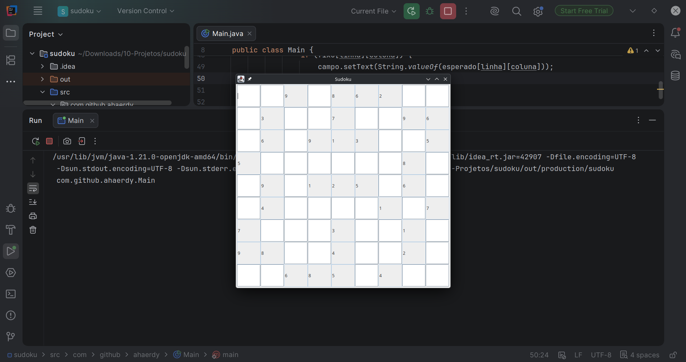
</p>

### Esquema de Implementação

<p align="center">
  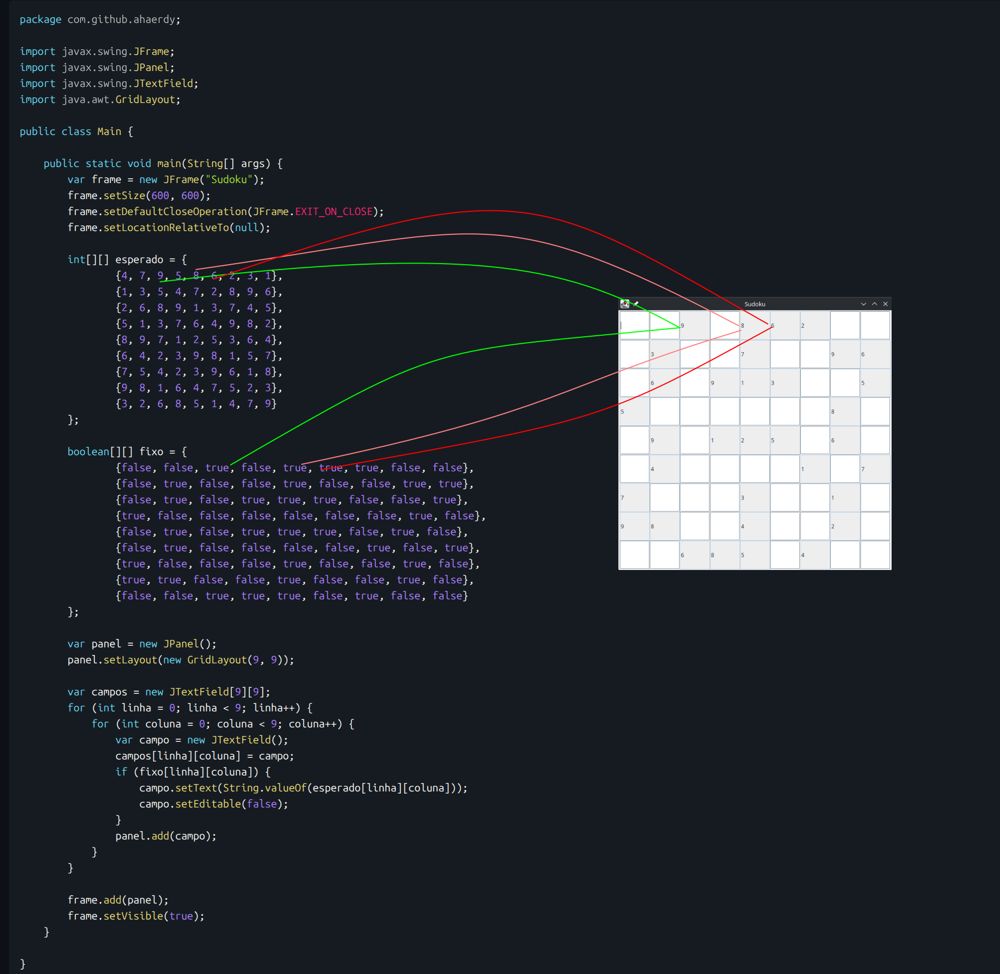
</p>

---

## Parte 4: Extração da Classe Space

**Data:** 11/09/2026

### Objetivo

Eliminar a fragilidade identificada ao final da etapa anterior: três arrays (`campos`, `esperado` e `fixo`) que precisavam viajar sempre sincronizados pela mesma coordenada, sem qualquer garantia do compilador contra erro de índice ou esquecimento em um deles. A solução adotada é agrupar esses dados relacionados em uma única classe de domínio.

### Implementação Realizada

- Criação do pacote `com.github.ahaerdy.model`.
- Criação, dentro desse pacote, da classe `Space`, responsável por representar uma única célula do tabuleiro: seu valor esperado, se é fixa e seu valor atualmente preenchido.
- Refatoração de `Main` para substituir os arrays `esperado` e `fixo` por uma única matriz de objetos `Space`.

### Código: Classe Space

```java
package com.github.ahaerdy.model;

public class Space {

    private Integer actual;
    private final int expected;
    private final boolean fixed;

    public Space(final int expected, final boolean fixed) {
        this.expected = expected;
        this.fixed = fixed;
        if (fixed) {
            actual = expected;
        }
    }

    public Integer getActual() {
        return actual;
    }

    public void setActual(final Integer actual) {
        if (fixed) return;
        this.actual = actual;
    }

    public void clearSpace() {
        setActual(null);
    }

    public int getExpected() {
        return expected;
    }

    public boolean isFixed() {
        return fixed;
    }
}
```

### Código: Main Refatorado

```java
package com.github.ahaerdy;

import com.github.ahaerdy.model.Space;

import javax.swing.JFrame;
import javax.swing.JPanel;
import javax.swing.JTextField;
import java.awt.GridLayout;

public class Main {

    public static void main(String[] args) {
        var frame = new JFrame("Sudoku");
        frame.setSize(600, 600);
        frame.setDefaultCloseOperation(JFrame.EXIT_ON_CLOSE);
        frame.setLocationRelativeTo(null);

        int[][] esperado = {
                {4, 7, 9, 5, 8, 6, 2, 3, 1},
                {1, 3, 5, 4, 7, 2, 8, 9, 6},
                {2, 6, 8, 9, 1, 3, 7, 4, 5},
                {5, 1, 3, 7, 6, 4, 9, 8, 2},
                {8, 9, 7, 1, 2, 5, 3, 6, 4},
                {6, 4, 2, 3, 9, 8, 1, 5, 7},
                {7, 5, 4, 2, 3, 9, 6, 1, 8},
                {9, 8, 1, 6, 4, 7, 5, 2, 3},
                {3, 2, 6, 8, 5, 1, 4, 7, 9}
        };

        boolean[][] fixo = {
                {false, false, true, false, true, true, true, false, false},
                {false, true, false, false, true, false, false, true, true},
                {false, true, false, true, true, true, false, false, true},
                {true, false, false, false, false, false, false, true, false},
                {false, true, false, true, true, true, false, true, false},
                {false, true, false, false, false, false, true, false, true},
                {true, false, false, false, true, false, false, true, false},
                {true, true, false, false, true, false, false, true, false},
                {false, false, true, true, true, false, true, false, false}
        };

        var panel = new JPanel();
        panel.setLayout(new GridLayout(9, 9));

        var espacos = new Space[9][9];
        for (int linha = 0; linha < 9; linha++) {
            for (int coluna = 0; coluna < 9; coluna++) {
                var space = new Space(esperado[linha][coluna], fixo[linha][coluna]);
                espacos[linha][coluna] = space;

                var campo = new JTextField();
                if (space.isFixed()) {
                    campo.setText(String.valueOf(space.getActual()));
                    campo.setEditable(false);
                }
                panel.add(campo);
            }
        }

        frame.add(panel);
        frame.setVisible(true);
    }

}
```

### Descrição Técnica

- `Space` agrupa, em um único objeto, exatamente os três dados que antes viviam espalhados em `esperado[][]`, `fixo[][]` e implicitamente no próprio `JTextField`: o valor esperado (`expected`), se a célula é fixa (`fixed`) e o valor atualmente preenchido (`actual`), sendo este último algo que os arrays da etapa anterior nem chegavam a representar de forma explícita.
- `expected` é `int` e `actual` é `Integer`. Essa diferença é deliberada: o valor esperado de uma célula sempre existe, então o tipo primitivo é suficiente; já o valor atualmente preenchido pode estar ausente (célula vazia), estado que só o tipo `Integer`, por aceitar `null`, é capaz de representar.
- O construtor de `Space` já inicializa `actual` com o próprio `expected` quando a célula é fixa, centralizando essa regra em um único lugar.
- `setActual(...)` recusa qualquer alteração quando `fixed` é verdadeiro. Isso introduz uma proteção que a etapa anterior não tinha: antes, a restrição de edição de uma célula fixa dependia inteiramente da camada visual (o campo de texto). Agora, mesmo uma tentativa de alterar o valor de uma célula fixa programaticamente, sem passar pela tela, é bloqueada pela própria classe de domínio.
- No `Main` refatorado, o array `campos[][]` foi removido. Como o laço não precisa mais localizar campos específicos após sua criação nesta etapa, a referência individual deixou de ser necessária. A matriz `espacos[][]` assume o papel antes dividido entre `esperado[][]` e `fixo[][]`.
- Mantida a chamada `campo.setEditable(false)`, e não `campo.setEnabled(false)`, para preservar a legibilidade dos valores fixos conforme a decisão já registrada na Parte 3.

### Glossário

| Termo | Significado |
|---|---|
| **Extração de classe** | Ato de agrupar dados e comportamentos relacionados, antes espalhados em estruturas separadas, em uma nova classe. Motivada aqui pela dificuldade real de manter três arrays sincronizados, não por planejamento prévio. |
| **Encapsulamento** | Proteção dos dados internos de um objeto por meio de atributos `private`, permitindo alterações apenas por métodos controlados, como `setActual` respeitando a regra de `fixed`. |
| **`Integer` vs `int`** | `Integer` é um tipo de referência (wrapper) e aceita o valor `null`, adequado para representar uma célula vazia. `int` é um tipo primitivo e nunca é `null`, adequado para um valor que sempre existe, como o esperado. |

### Resultado

Execução de `Main` concluída com sucesso, com comportamento visual idêntico ao da etapa anterior: dicas preenchidas e não editáveis, demais células vazias e editáveis. Nenhuma mudança perceptível para quem joga; a diferença desta etapa está inteiramente na organização interna do código.

<p align="center">
  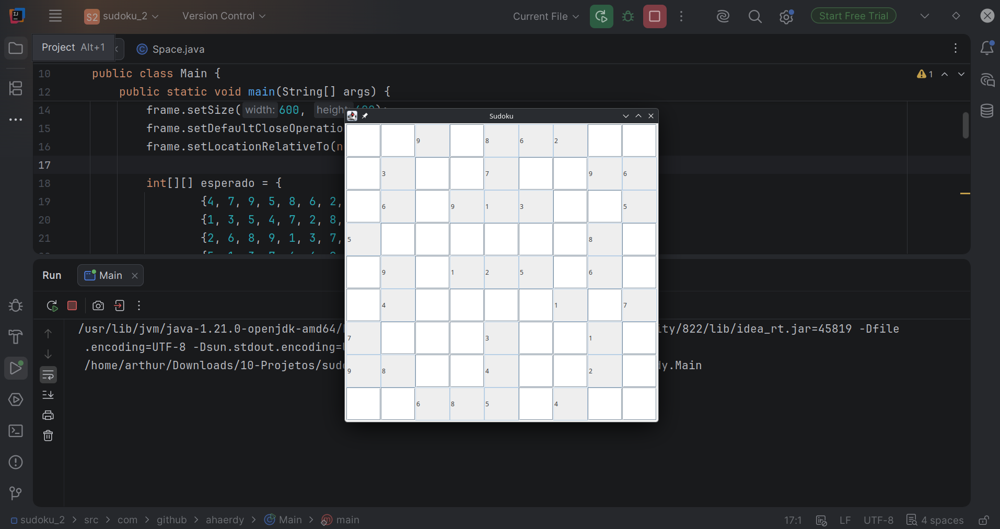
</p>

### Esquema de Implementação

<p align="center">
  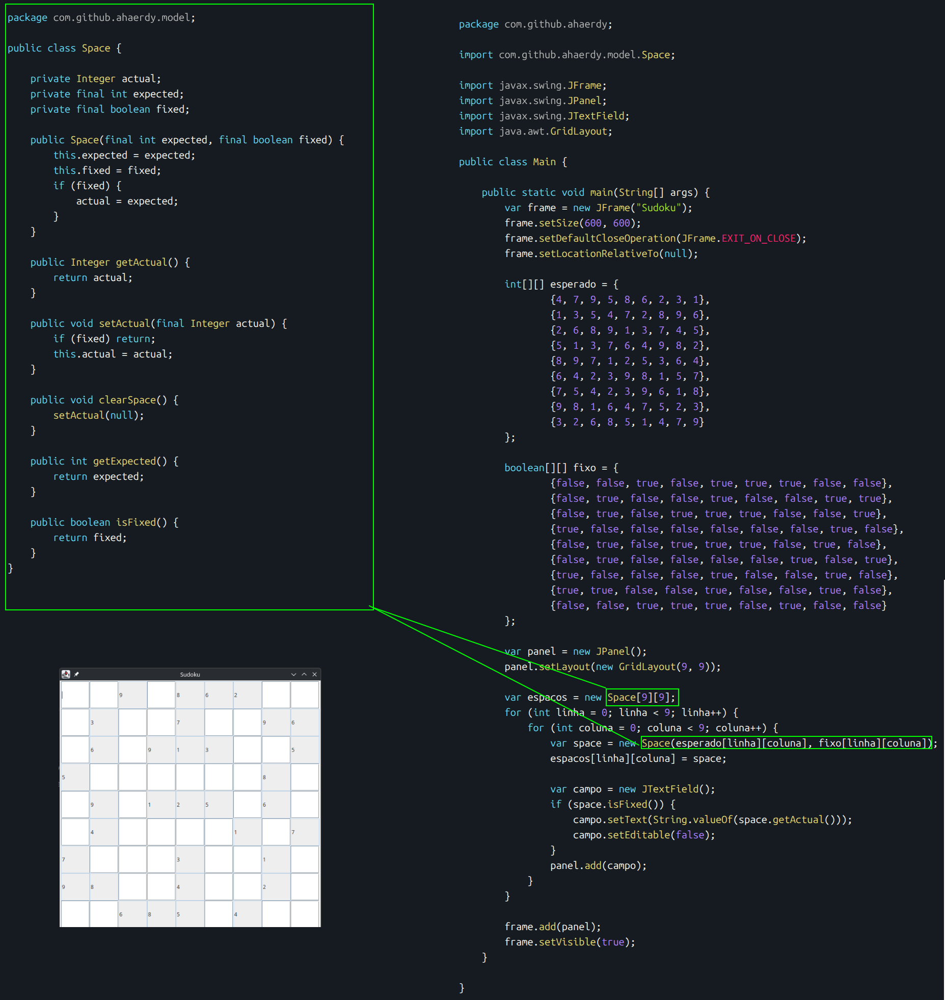
</p>

---
## Parte 5: Restrição de Digitação e Sincronização com o Space

**Data:** 11/09/2026

### Objetivo

Resolver dois problemas remanescentes na interação do jogador com o tabuleiro: a ausência de qualquer restrição sobre o que pode ser digitado em uma célula livre (letras, múltiplos caracteres) e a falta de sincronização entre o texto exibido no campo e o valor armazenado no `Space` correspondente, que até esta etapa não se comunicavam.

### Implementação Realizada

- Criação do pacote `com.github.ahaerdy.ui.custom.input`.
- Criação da classe `NumberTextLimit`, uma extensão de `PlainDocument` responsável por restringir a digitação a um único dígito entre "1" e "9" por campo.
- Criação da classe `NumberText`, uma extensão de `JTextField` que concentra toda a configuração de uma célula: aparência, restrição de digitação, edição condicionada a `fixed`, e sincronização com o `Space` associado por meio de um `DocumentListener`.
- Refatoração do laço de montagem do tabuleiro em `Main` para instanciar `NumberText` diretamente a partir de cada `Space`, eliminando a criação manual de `JTextField`.

### Código: NumberTextLimit

```java
package com.github.ahaerdy.ui.custom.input;

import javax.swing.text.AttributeSet;
import javax.swing.text.BadLocationException;
import javax.swing.text.PlainDocument;
import java.util.List;

import static java.util.Objects.isNull;

public class NumberTextLimit extends PlainDocument {

    private final List<String> NUMBERS = List.of("1", "2", "3", "4", "5", "6", "7", "8", "9");

    @Override
    public void insertString(final int offs, final String str, final AttributeSet a) throws BadLocationException {
        if (isNull(str) || (!NUMBERS.contains(str))) return;

        if (getLength() + str.length() <= 1) {
            super.insertString(offs, str, a);
        }
    }
}
```

### Código: NumberText

```java
package com.github.ahaerdy.ui.custom.input;

import com.github.ahaerdy.model.Space;

import javax.swing.JTextField;
import javax.swing.event.DocumentEvent;
import javax.swing.event.DocumentListener;
import java.awt.Color;
import java.awt.Dimension;
import java.awt.Font;

public class NumberText extends JTextField {

    private final Space space;

    public NumberText(final Space space) {
        this.space = space;
        var dimension = new Dimension(50, 50);
        this.setSize(dimension);
        this.setPreferredSize(dimension);
        this.setVisible(true);
        this.setHorizontalAlignment(CENTER);
        this.setDocument(new NumberTextLimit());
        this.setEditable(!space.isFixed());
        if (space.isFixed()) {
            this.setText(space.getActual().toString());
            this.setFont(new Font("Arial", Font.BOLD, 20));
            this.setBackground(new Color(224, 224, 224));
            this.setForeground(Color.BLACK);
        } else {
            this.setFont(new Font("Arial", Font.PLAIN, 20));
        }
        this.getDocument().addDocumentListener(new DocumentListener() {

            @Override
            public void insertUpdate(final DocumentEvent e) {
                changeSpace();
            }

            @Override
            public void removeUpdate(final DocumentEvent e) {
                changeSpace();
            }

            @Override
            public void changedUpdate(final DocumentEvent e) {
                changeSpace();
            }

            private void changeSpace() {
                if (getText().isEmpty()) {
                    space.clearSpace();
                    return;
                }
                space.setActual(Integer.parseInt(getText()));
            }

        });
    }
}
```

### Código: Main Refatorado

```java
        var espacos = new Space[9][9];
        for (int linha = 0; linha < 9; linha++) {
            for (int coluna = 0; coluna < 9; coluna++) {
                var space = new Space(esperado[linha][coluna], fixo[linha][coluna]);
                espacos[linha][coluna] = space;

                var campo = new NumberText(space);
                panel.add(campo);
            }
        }
```

### Descrição Técnica

- `NumberTextLimit` sobrescreve `insertString`, o método chamado internamente pelo Swing a cada tentativa de inserção de texto em um `Document`. A validação rejeita qualquer caractere fora da lista `NUMBERS` e qualquer inserção que ultrapasse um único caractere no campo.
- `NumberText` concentra em um único lugar toda a configuração que antes estava distribuída entre `Main` e as consultas diretas aos arrays: tamanho, fonte, alinhamento, documento restrito, condição de edição e valor inicial.
- `DocumentListener` expõe três métodos (`insertUpdate`, `removeUpdate`, `changedUpdate`), cobrindo os três tipos de mudança possíveis em um `Document`. Os três delegam para o método privado `changeSpace()`, que atualiza `space.setActual(...)` com o valor digitado ou chama `space.clearSpace()` quando o campo fica vazio.
- Esta classe é a primeira, no projeto, a manter uma via de sincronização ativa entre a interface e o domínio: até aqui, o `Space` era apenas consultado para exibição; a partir desta etapa, ele também é atualizado a partir da interação do usuário.
- O laço de montagem do tabuleiro em `Main` foi reduzido a três instruções por célula: criar o `Space`, criar o `NumberText(space)` a partir dele, e adicionar o campo ao painel. Toda a configuração visual e a lógica de sincronização, antes potencialmente espalhadas pelo `Main`, passaram a residir inteiramente dentro de `NumberText`.

### Incidente: Recorrência do Problema de Legibilidade

Ao executar o projeto após esta etapa, o mesmo problema já identificado e corrigido na Parte 3 reapareceu: os valores das células fixas foram exibidos em um tom de cinza-azulado claro, de difícil leitura contra o fundo do tema em uso. A causa foi a mesma de então: a classe `NumberText`, por ter sido escrita como uma unidade nova e independente, não reaproveitou a decisão já tomada anteriormente de usar `setEditable(false)` no lugar de `setEnabled(false)`, reintroduzindo a chamada a `setEnabled(!space.isFixed())`.

Esse tipo de recorrência é comum quando uma mesma responsabilidade é reimplementada em um novo componente: a correção aplicada em um ponto do código não se propaga automaticamente para outro ponto que resolve o mesmo problema de forma independente.

### Correção e Melhoria Visual Adotadas

Duas mudanças foram aplicadas em conjunto:

1. **Correção:** substituição de `setEnabled(!space.isFixed())` por `setEditable(!space.isFixed())`, restabelecendo a decisão já registrada na Parte 3 e eliminando a perda de legibilidade.
2. **Melhoria:** para além de apenas corrigir a legibilidade, decidiu-se diferenciar visualmente as células fixas das editáveis de forma explícita, sem depender de o jogador tentar editar uma célula para descobrir que ela é fixa:
   - Fonte em negrito (`Font.BOLD`) para o valor de células fixas, contra fonte normal (`Font.PLAIN`) nas editáveis.
   - Fundo cinza-claro (`new Color(224, 224, 224)`) aplicado apenas às células fixas, via `setBackground(...)`.
   - Cor de texto forçada para preto (`Color.BLACK`) via `setForeground(...)`, garantindo alto contraste contra o novo fundo e independência do tema do sistema operacional.

Essa mudança é puramente visual: `setEditable(!space.isFixed())` continua sendo o mecanismo que efetivamente impede a edição das células fixas; a formatação adicional apenas reforça essa informação para o jogador à primeira vista.

### Glossário

| Termo | Significado |
|---|---|
| **`PlainDocument`** | Implementação padrão de `Document` no Swing, responsável por armazenar o conteúdo textual de um componente como `JTextField`. Pode ser estendida para customizar regras de digitação. |
| **`DocumentListener`** | Interface do Swing usada para reagir a mudanças no conteúdo de um `Document`: inserção, remoção ou alteração de atributos. |
| **`Font.BOLD` / `Font.PLAIN`** | Constantes que definem o estilo de uma fonte, negrito ou normal, respectivamente. |
| **`Color`** | Classe do pacote `java.awt` que representa uma cor, seja por nome (`Color.BLACK`) ou por componentes RGB (`new Color(224, 224, 224)`). |
| **`setBackground` / `setForeground`** | Métodos do Swing que definem, respectivamente, a cor de fundo e a cor do texto de um componente. |

### Resultado

Execução de `Main` concluída com sucesso, após a correção: os valores das células fixas passaram a ser exibidos em negrito preto sobre fundo cinza-claro, com alta legibilidade e clara diferenciação visual em relação às células editáveis. A restrição de digitação foi validada com tentativas de inserção de letras e de múltiplos dígitos em uma mesma célula, ambas corretamente bloqueadas.

<p align="center">  
    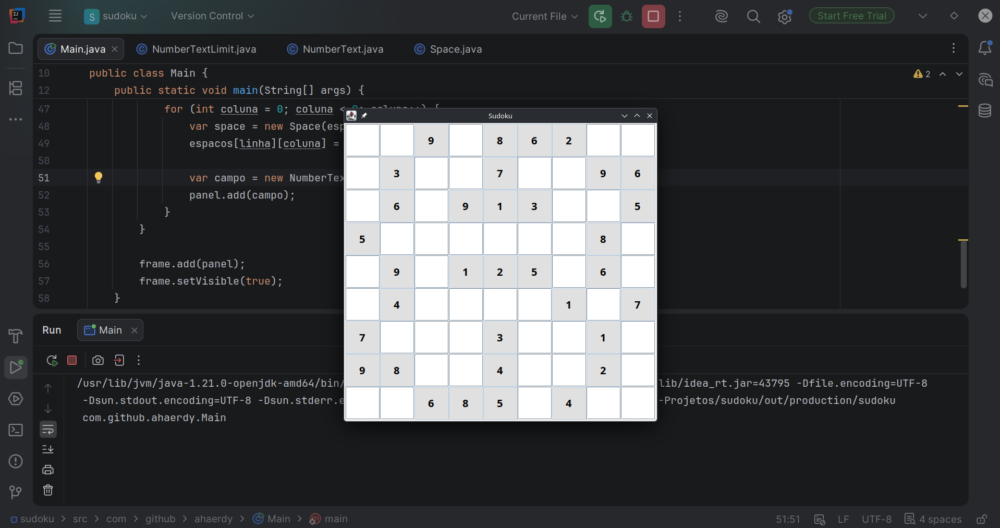
</p>

### Esquema de Implementação

<p align="center">
  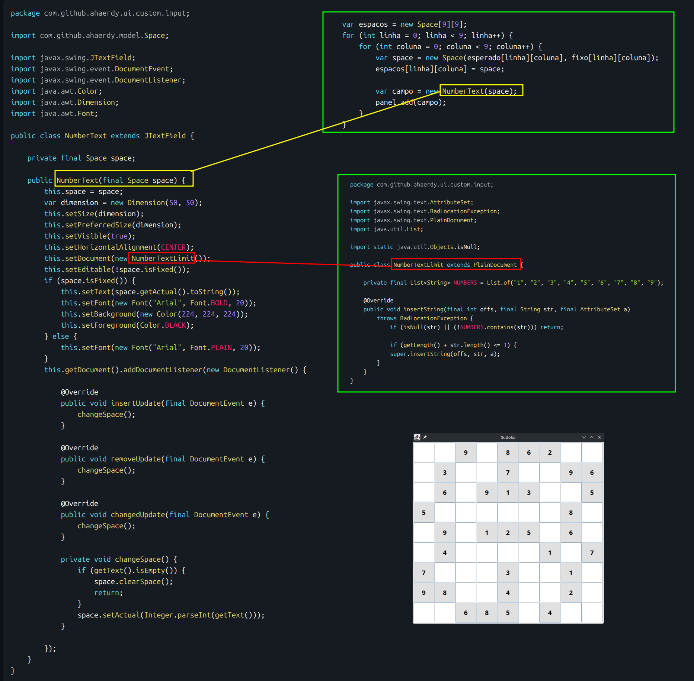
</p>

---

## Parte 6: Organização Visual em Blocos 3x3

**Data:** 11/09/2026

### Objetivo

Corrigir a divergência visual entre o tabuleiro exibido até esta etapa (uma grade uniforme 9x9, sem qualquer separação interna) e a aparência real de um Sudoku, que exige a demarcação clara dos nove blocos de 3x3 células.

### Implementação Realizada

- Criação do pacote `com.github.ahaerdy.ui.custom.panel`.
- Criação da classe `SudokuSector`, um painel Swing que agrupa 9 células (`NumberText`) em uma grade interna 3x3, com borda destacada.
- Reestruturação completa do laço de montagem do tabuleiro em `Main`: o painel principal passou a organizar 9 `SudokuSector` (em vez de 81 células diretamente), e cada `SudokuSector` passou a ser montado por um laço próprio, responsável por reunir as 9 células daquele bloco específico antes de o bloco ser adicionado ao painel.

Implementação seguiu integralmente a estrutura de referência adotada para este projeto, sem alterações. Execução validada com sucesso.

### Código: SudokuSector

```java
package com.github.ahaerdy.ui.custom.panel;

import com.github.ahaerdy.ui.custom.input.NumberText;

import javax.swing.JPanel;
import javax.swing.border.LineBorder;
import java.awt.GridLayout;
import java.util.List;

import static java.awt.Color.black;

public class SudokuSector extends JPanel {

    public SudokuSector(final List<NumberText> campos) {
        this.setLayout(new GridLayout(3, 3));
        this.setBorder(new LineBorder(black, 2, true));
        campos.forEach(this::add);
    }

}
```

### Código: Main Refatorado

```java
package com.github.ahaerdy;

import com.github.ahaerdy.model.Space;
import com.github.ahaerdy.ui.custom.input.NumberText;
import com.github.ahaerdy.ui.custom.panel.SudokuSector;

import javax.swing.JFrame;
import javax.swing.JPanel;
import java.awt.GridLayout;
import java.util.ArrayList;
import java.util.List;

public class Main {

    public static void main(String[] args) {
        var frame = new JFrame("Sudoku");
        frame.setSize(600, 600);
        frame.setDefaultCloseOperation(JFrame.EXIT_ON_CLOSE);
        frame.setLocationRelativeTo(null);

        int[][] esperado = {
                {4, 7, 9, 5, 8, 6, 2, 3, 1},
                {1, 3, 5, 4, 7, 2, 8, 9, 6},
                {2, 6, 8, 9, 1, 3, 7, 4, 5},
                {5, 1, 3, 7, 6, 4, 9, 8, 2},
                {8, 9, 7, 1, 2, 5, 3, 6, 4},
                {6, 4, 2, 3, 9, 8, 1, 5, 7},
                {7, 5, 4, 2, 3, 9, 6, 1, 8},
                {9, 8, 1, 6, 4, 7, 5, 2, 3},
                {3, 2, 6, 8, 5, 1, 4, 7, 9}
        };

        boolean[][] fixo = {
                {false, false, true, false, true, true, true, false, false},
                {false, true, false, false, true, false, false, true, true},
                {false, true, false, true, true, true, false, false, true},
                {true, false, false, false, false, false, false, true, false},
                {false, true, false, true, true, true, false, true, false},
                {false, true, false, false, false, false, true, false, true},
                {true, false, false, false, true, false, false, true, false},
                {true, true, false, false, true, false, false, true, false},
                {false, false, true, true, true, false, true, false, false}
        };

        var panel = new JPanel();
        panel.setLayout(new GridLayout(3, 3));

        var espacos = new Space[9][9];
        for (int blocoLinha = 0; blocoLinha < 9; blocoLinha += 3) {
            for (int blocoColuna = 0; blocoColuna < 9; blocoColuna += 3) {
                List<NumberText> camposDoBloco = new ArrayList<>();
                for (int linha = blocoLinha; linha < blocoLinha + 3; linha++) {
                    for (int coluna = blocoColuna; coluna < blocoColuna + 3; coluna++) {
                        var space = new Space(esperado[linha][coluna], fixo[linha][coluna]);
                        espacos[linha][coluna] = space;
                        camposDoBloco.add(new NumberText(space));
                    }
                }
                panel.add(new SudokuSector(camposDoBloco));
            }
        }

        frame.add(panel);
        frame.setVisible(true);
    }

}
```

### Descrição Técnica

- `SudokuSector` é, ele mesmo, um `JPanel` com `GridLayout(3, 3)` interno e uma `LineBorder` preta de 2 pixels com cantos arredondados (`new LineBorder(black, 2, true)`), aplicada sobre o conjunto das 9 células recebidas em `campos`.
- O painel principal (`panel`) passou a usar `GridLayout(3, 3)` também, mas agora organizando 9 `SudokuSector`, não mais 81 células diretamente. O resultado é uma grade de grades: um `GridLayout(3,3)` externo, contendo 9 painéis que são, cada um, outro `GridLayout(3,3)` interno.

### Detalhamento: Por Que o Laço de Montagem Tem Quatro Níveis

Até a etapa anterior, um único par de coordenadas (`linha`, `coluna`) bastava para identificar qualquer uma das 81 células. Nesta etapa, a montagem do tabuleiro passou a depender de dois sistemas de coordenadas simultâneos: **coordenadas de bloco** (qual dos 9 blocos 3x3 está sendo montado) e **coordenadas de célula dentro do bloco** (qual das 9 células daquele bloco específico). Cada sistema exige seu próprio par de laços, o que eleva a estrutura de dois para quatro níveis de profundidade:

- Nível 1 e 2 (`blocoLinha`, `blocoColuna`, incrementados de 3 em 3): percorrem os 9 blocos.
- Nível 3 e 4 (`linha`, `coluna`): percorrem as 9 células de um bloco específico.

Um detalhe relevante da implementação: os laços internos não iniciam em `0`, e sim em `blocoLinha` e `blocoColuna`, respectivamente (`for (int linha = blocoLinha; linha < blocoLinha + 3; linha++)`). Como consequência, `linha` e `coluna`, dentro do laço mais interno, já correspondem às coordenadas **globais** da célula (0 a 8), compatíveis diretamente com `espacos[linha][coluna]`, `esperado[linha][coluna]` e `fixo[linha][coluna]`, sem exigir nenhuma conversão adicional entre coordenada local e global.

**Rastreamento da primeira iteração dos laços externos** (`blocoLinha = 0`, `blocoColuna = 0`):

| Iteração interna | `linha` | `coluna` | Célula global criada |
|---|---|---|---|
| 1 | 0 | 0 | `espacos[0][0]` |
| 2 | 0 | 1 | `espacos[0][1]` |
| 3 | 0 | 2 | `espacos[0][2]` |
| 4 | 1 | 0 | `espacos[1][0]` |
| 5 | 1 | 1 | `espacos[1][1]` |
| 6 | 1 | 2 | `espacos[1][2]` |
| 7 | 2 | 0 | `espacos[2][0]` |
| 8 | 2 | 1 | `espacos[2][1]` |
| 9 | 2 | 2 | `espacos[2][2]` |

Ao final dessas 9 iterações internas, `camposDoBloco` contém as 9 células do primeiro bloco, é envolvido por um `SudokuSector` e adicionado ao painel principal. Somente então o laço de `blocoColuna` avança para `3`, repetindo o mesmo processo para o bloco seguinte, à direita do primeiro.

**Ordem de visita dos 9 blocos**, determinada por `blocoLinha` ser o laço mais externo:

| | `blocoColuna=0` | `blocoColuna=3` | `blocoColuna=6` |
|---|---|---|---|
| **`blocoLinha=0`** | 1º bloco | 2º bloco | 3º bloco |
| **`blocoLinha=3`** | 4º bloco | 5º bloco | 6º bloco |
| **`blocoLinha=6`** | 7º bloco | 8º bloco | 9º bloco |

Essa é também a ordem em que `panel.add(new SudokuSector(...))` é chamado e, por consequência, a ordem em que o `GridLayout(3, 3)` do painel principal posiciona cada bloco na tela, da esquerda para a direita, de cima para baixo. A ordem de execução do laço e a ordem visual na janela coincidem porque `GridLayout` posiciona os componentes exatamente na ordem em que `add(...)` é chamado, sem exceção.

Um ponto de atenção identificado na leitura do código: a declaração `List<NumberText> camposDoBloco = new ArrayList<>();` está posicionada dentro do laço de `blocoColuna`, não fora dele. Isso garante que uma lista nova seja criada a cada um dos 9 blocos. Caso essa declaração estivesse fora dos dois laços externos, todos os blocos acabariam compartilhando a mesma lista, e as 81 células seriam acumuladas em um único `SudokuSector` ao final da execução: um erro de escopo que não impediria a compilação, mas comprometeria inteiramente o resultado visual.

### Glossário

| Termo | Significado |
|---|---|
| **`LineBorder`** | Classe do Swing que desenha uma borda simples ao redor de um componente. |
| **Laço de quatro níveis** | Dois pares de laços aninhados: o par externo navega entre os 9 blocos (coordenadas de bloco), o par interno navega entre as 9 células de um mesmo bloco (coordenadas globais de célula). |
| **Coordenada global vs. coordenada local** | A coordenada global identifica uma célula entre as 81 do tabuleiro inteiro; a coordenada local identificaria uma célula apenas dentro do seu bloco (0 a 2 em cada eixo). Esta implementação utiliza coordenadas globais também nos laços internos. |
| **Escopo de variável dentro de laço** | Uma variável declarada dentro do corpo de um laço é recriada a cada iteração daquele laço, isolada das demais iterações, diferente de uma variável declarada fora do laço, que seria compartilhada entre todas as iterações. |

### Resultado

Execução de `Main` concluída com sucesso: o tabuleiro passou a ser exibido com os nove blocos 3x3 claramente demarcados por bordas pretas grossas, reproduzindo a aparência visual padrão de um Sudoku. A disposição dos números, fixos e editáveis, manteve-se correta e coerente com as etapas anteriores, com as células fixas exibidas em negrito sobre fundo cinza, conforme implementado na Parte 5.

<p align="center">
   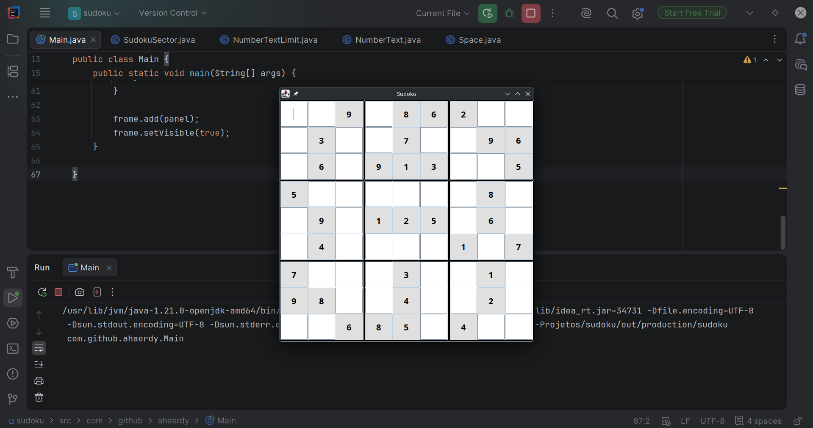
</p>

### Esquema de Implementação

<p align="center">
  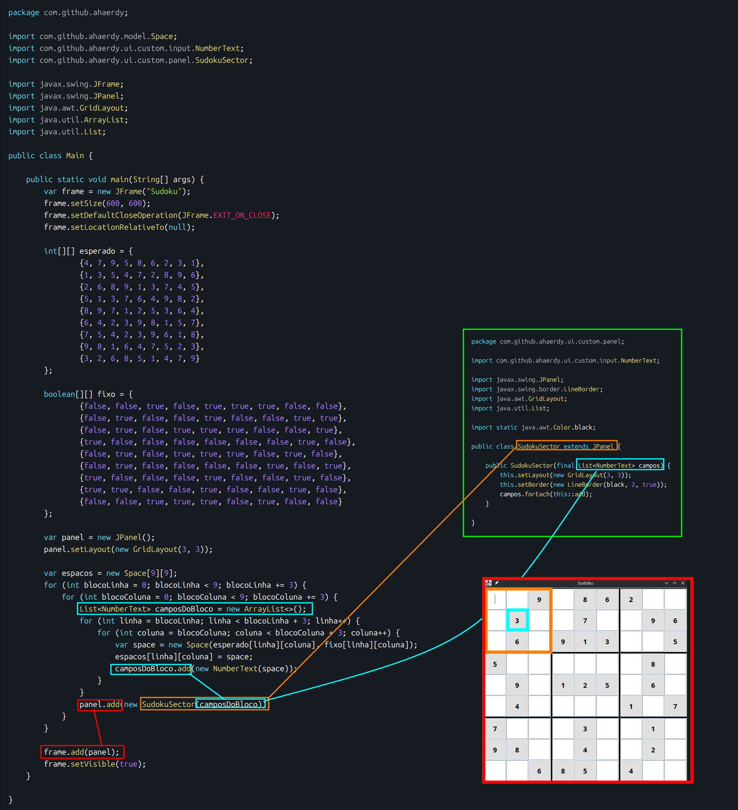
</p>

---

## Parte 7: Botão de Verificação do Jogo

**Data:** 11/09/2026

### Objetivo

Dar ao jogador algum retorno sobre o estado da partida: se o tabuleiro já está completo e se contém erros em relação à solução esperada. A verificação foi implementada diretamente no clique de um botão, sem qualquer preocupação de organização interna nesta etapa.

### Implementação Realizada

- Criação de um `JButton` ("Verificar jogo"), com a lógica de verificação escrita diretamente dentro de seu `ActionListener`.
- Reestruturação da montagem da janela em dois painéis distintos: `boardPanel`, contendo os nove `SudokuSector` sob `GridLayout(3, 3)`, e `frame`, agora sob `BorderLayout`, organizando `boardPanel` na região central e o botão de verificação na região inferior.
- Ajuste adicional de estilo: aumento da fonte do botão, via `setFont(new Font("SansSerif", Font.BOLD, 20))`, para melhorar sua legibilidade em relação ao tamanho padrão.
- Ajuste adicional de estilo: aumento da fonte do texto e do botão de confirmação exibidos dentro da caixa de diálogo (`JOptionPane`), via `UIManager.put(...)`, configurado uma única vez no início do método `main`.

### Motivação da Reestruturação em Dois Painéis

O painel usado até a etapa anterior (`panel`) estava configurado com `GridLayout(3, 3)`, já ocupado integralmente pelos nove `SudokuSector`. Adicionar um décimo componente, o botão, a esse mesmo painel não impede a compilação nem a execução, mas distorce a distribuição do layout, já dimensionado para exatamente nove elementos. A solução adotada foi separar as responsabilidades em dois níveis: um painel dedicado exclusivamente ao tabuleiro (`boardPanel`), e a janela (`frame`) responsável por organizar esse tabuleiro junto ao botão, sob um layout diferente e compatível com regiões nomeadas.

### Código

```java
package com.github.ahaerdy;

import com.github.ahaerdy.model.Space;
import com.github.ahaerdy.ui.custom.input.NumberText;
import com.github.ahaerdy.ui.custom.panel.SudokuSector;

import javax.swing.JButton;
import javax.swing.JFrame;
import javax.swing.JOptionPane;
import javax.swing.JPanel;
import javax.swing.UIManager;
import java.awt.BorderLayout;
import java.awt.Font;
import java.awt.GridLayout;
import java.util.ArrayList;
import java.util.List;

public class Main {

    public static void main(String[] args) {
        UIManager.put("OptionPane.messageFont", new Font("SansSerif", Font.PLAIN, 18));
        UIManager.put("OptionPane.buttonFont", new Font("SansSerif", Font.PLAIN, 16));
        var frame = new JFrame("Sudoku");
        frame.setSize(600, 650);
        frame.setDefaultCloseOperation(JFrame.EXIT_ON_CLOSE);
        frame.setLocationRelativeTo(null);
        frame.setLayout(new BorderLayout());

        int[][] esperado = {
                {4, 7, 9, 5, 8, 6, 2, 3, 1},
                {1, 3, 5, 4, 7, 2, 8, 9, 6},
                {2, 6, 8, 9, 1, 3, 7, 4, 5},
                {5, 1, 3, 7, 6, 4, 9, 8, 2},
                {8, 9, 7, 1, 2, 5, 3, 6, 4},
                {6, 4, 2, 3, 9, 8, 1, 5, 7},
                {7, 5, 4, 2, 3, 9, 6, 1, 8},
                {9, 8, 1, 6, 4, 7, 5, 2, 3},
                {3, 2, 6, 8, 5, 1, 4, 7, 9}
        };

        boolean[][] fixo = {
                {false, false, true, false, true, true, true, false, false},
                {false, true, false, false, true, false, false, true, true},
                {false, true, false, true, true, true, false, false, true},
                {true, false, false, false, false, false, false, true, false},
                {false, true, false, true, true, true, false, true, false},
                {false, true, false, false, false, false, true, false, true},
                {true, false, false, false, true, false, false, true, false},
                {true, true, false, false, true, false, false, true, false},
                {false, false, true, true, true, false, true, false, false}
        };

        var boardPanel = new JPanel();
        boardPanel.setLayout(new GridLayout(3, 3));

        var espacos = new Space[9][9];
        for (int blocoLinha = 0; blocoLinha < 9; blocoLinha += 3) {
            for (int blocoColuna = 0; blocoColuna < 9; blocoColuna += 3) {
                List<NumberText> camposDoBloco = new ArrayList<>();
                for (int linha = blocoLinha; linha < blocoLinha + 3; linha++) {
                    for (int coluna = blocoColuna; coluna < blocoColuna + 3; coluna++) {
                        var space = new Space(esperado[linha][coluna], fixo[linha][coluna]);
                        espacos[linha][coluna] = space;
                        camposDoBloco.add(new NumberText(space));
                    }
                }
                boardPanel.add(new SudokuSector(camposDoBloco));
            }
        }

        var verificarButton = new JButton("Verificar jogo");
        verificarButton.setFont(new Font("SansSerif", Font.BOLD, 20));
        verificarButton.addActionListener(e -> {
            boolean completo = true;
            boolean temErro = false;
            for (int linha = 0; linha < 9; linha++) {
                for (int coluna = 0; coluna < 9; coluna++) {
                    var space = espacos[linha][coluna];
                    if (space.getActual() == null) {
                        completo = false;
                    } else if (!space.getActual().equals(space.getExpected())) {
                        temErro = true;
                    }
                }
            }
            String mensagem = completo ? "O jogo está completo" : "O jogo está incompleto";
            mensagem += temErro ? " e contém erros" : " e não contém erros";
            JOptionPane.showMessageDialog(null, mensagem);
        });

        frame.add(boardPanel, BorderLayout.CENTER);
        frame.add(verificarButton, BorderLayout.SOUTH);
        frame.setVisible(true);
    }

}
```

### Descrição Técnica

- `frame.setLayout(new BorderLayout())`: substitui o layout da janela por um esquema de cinco regiões nomeadas (`NORTH`, `SOUTH`, `EAST`, `WEST`, `CENTER`), cada uma comportando um único componente (ou painel, que por sua vez pode conter vários).
- `frame.add(boardPanel, BorderLayout.CENTER)`: posiciona o tabuleiro na região central, a que ocupa todo o espaço remanescente após as demais regiões serem dimensionadas.
- `frame.add(verificarButton, BorderLayout.SOUTH)`: posiciona o botão em uma faixa inferior, fora da área do tabuleiro.
- Dentro do `ActionListener` do botão, o laço percorre as 81 posições de `espacos[][]`, verificando duas condições independentes: se alguma célula está sem valor preenchido (`completo = false`) e se alguma célula preenchida diverge do valor esperado (`temErro = true`). As duas variáveis booleanas acumulam o resultado da varredura completa antes de montar a mensagem final.
- Os dois ajustes de estilo desta etapa — fonte do botão e fonte da caixa de diálogo — são detalhados separadamente logo abaixo, por envolverem mecanismos diferentes do Swing.

#### Destaque: aumentando a fonte do botão

```java
var verificarButton = new JButton("Verificar jogo");
verificarButton.setFont(new Font("SansSerif", Font.BOLD, 20));
```

A fonte padrão de um `JButton` tende a ficar pequena em relação ao restante da interface, que já usa fonte tamanho 20 nas células do tabuleiro (definida em `NumberText`, na Parte 5). A chamada `setFont(new Font("SansSerif", Font.BOLD, 20))`, feita diretamente sobre a instância do botão, iguala esse tamanho e aplica negrito, reforçando a importância visual do botão como principal ponto de interação fora do tabuleiro.

Vale registrar a escolha de `"SansSerif"` em vez de `"Arial"` (a fonte usada em `NumberText`): `"SansSerif"` é uma das cinco **fontes lógicas** que o Java garante existir em qualquer sistema operacional, independentemente do que estiver instalado (as demais são `"Serif"`, `"Monospaced"`, `"Dialog"` e `"DialogInput"`) — o próprio Java resolve essa fonte lógica para uma fonte real equivalente em tempo de execução. `"Arial"` é uma fonte física específica, que pode não existir em todo sistema (nesse caso, o Java substitui silenciosamente por outra). Para o botão, optou-se pela alternativa mais portável.

#### Destaque: aumentando a fonte da caixa de diálogo (`JOptionPane`)

```java
UIManager.put("OptionPane.messageFont", new Font("SansSerif", Font.PLAIN, 18));
UIManager.put("OptionPane.buttonFont", new Font("SansSerif", Font.PLAIN, 16));
```

Diferente do botão, um `JOptionPane` não expõe um método `setFont(...)` para configurar depois de criado — `JOptionPane.showMessageDialog(...)` constrói e já exibe a caixa de diálogo inteira em uma única chamada, sem devolver nenhuma referência configurável. O ajuste, portanto, precisa ser global, feito através da classe `UIManager` — o componente central do Swing que armazena as configurações visuais padrão (fontes, cores, ícones) de cada tipo de componente, aplicadas a toda a aplicação.

Duas propriedades são sobrescritas: `"OptionPane.messageFont"` (a fonte do texto da mensagem) e `"OptionPane.buttonFont"` (a fonte dos botões internos do diálogo, como "OK"). Essas duas linhas foram posicionadas no início do método `main`, antes de qualquer componente gráfico ser criado — o `UIManager` é consultado no momento em que cada componente é efetivamente construído, de modo que uma configuração feita depois da exibição de um diálogo não teria efeito retroativo sobre ele.

Uma diferença importante em relação ao ajuste do botão: enquanto `setFont(...)` precisa ser repetido em cada `JButton` individualmente, a configuração via `UIManager` é feita **uma única vez** e vale para todos os diálogos exibidos durante toda a execução do programa, inclusive os que ainda serão criados em etapas futuras.

### Glossário

| Termo | Significado |
|---|---|
| **`JButton`** | Componente do Swing que representa um botão clicável. |
| **`ActionListener`** | Interface que reage a um evento de ação, como o clique em um botão. |
| **`BorderLayout`** | Gerenciador de layout que organiza até cinco regiões nomeadas (`NORTH`, `SOUTH`, `EAST`, `WEST`, `CENTER`) dentro de um contêiner. |
| **`JOptionPane.showMessageDialog`** | Exibe uma caixa de diálogo simples com uma mensagem e um botão de confirmação. |
| **`UIManager`** | Classe central do Swing que armazena as configurações visuais padrão (fontes, cores, ícones) de cada tipo de componente, aplicadas a toda a aplicação. |

### Resultado

Execução de `Main` concluída com sucesso: o tabuleiro passou a ser exibido na região central da janela, com o botão "Verificar jogo" destacado abaixo dele, em fonte maior e negrito. O clique no botão exibiu corretamente a mensagem correspondente ao estado do tabuleiro, agora também em fonte maior dentro da própria caixa de diálogo, mantendo consistência visual com o restante da interface. Confirmou-se, adicionalmente, que os valores digitados vêm sendo corretamente sincronizados com os respectivos `Space` desde a Parte 5.

<p align="center">
  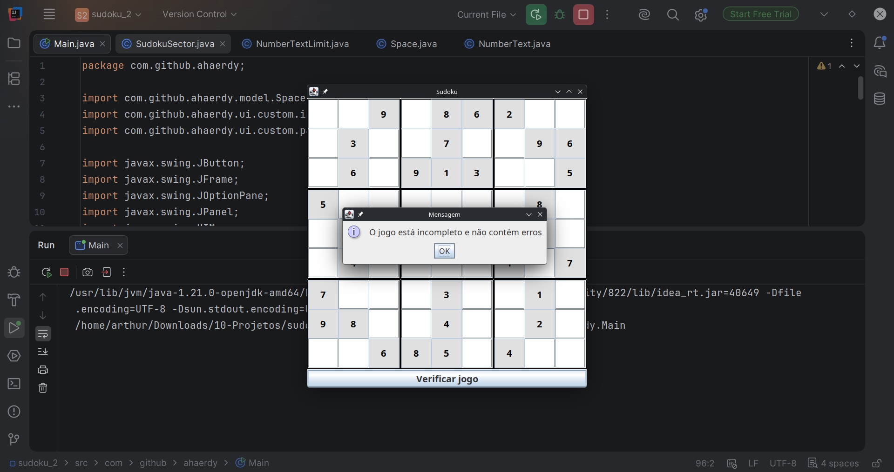
</p>

### Esquema de IMplementação

<p align="center">
  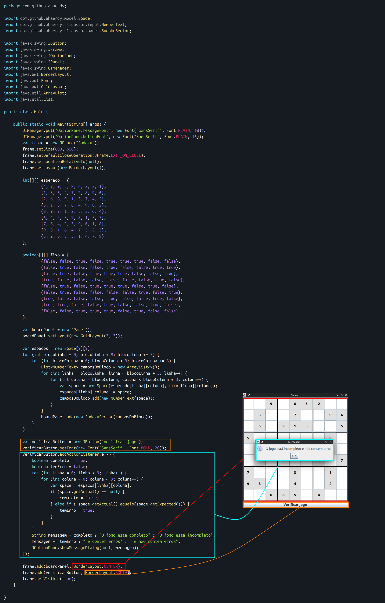
</p>

---

## Parte 8: Extração de Board e GameStatusEnum

**Data:** 13/09/2026

### Objetivo

Eliminar a lógica de verificação de status embutida diretamente no `ActionListener` do botão "Verificar jogo", extraindo-a para classes de domínio próprias. A motivação é evitar a duplicação que ocorreria ao implementar os próximos botões (reiniciar, concluir), que precisariam repetir o mesmo laço de varredura das 81 células.

### Implementação Realizada

- Criação do enum `GameStatusEnum`, com três valores nomeados (`NON_STARTED`, `INCOMPLETE`, `COMPLETE`) e um rótulo textual amigável associado a cada um.
- Criação da classe `Board`, responsável por calcular o status agregado do jogo (`getStatus()`) e verificar inconsistências entre valores preenchidos e esperados (`hasErrors()`).
- Alteração da estrutura de dados usada para armazenar as 81 células: substituição do array `Space[9][9]` por uma `List<List<Space>>`, exigida pelo construtor de `Board`.
- Refatoração do `ActionListener` do botão "Verificar jogo", que passou a delegar inteiramente a lógica de verificação para o `Board` recém-criado, eliminando o laço manual que antes calculava `completo` e `temErro`.

Implementação seguiu integralmente a estrutura de referência adotada para este projeto, sem alterações. O resultado visual da execução permanece idêntico ao da Parte 7, uma vez que o ajuste desta etapa é inteiramente interno, sem impacto na interface.

### Código: GameStatusEnum

```java
package com.github.ahaerdy.model;

public enum GameStatusEnum {

    NON_STARTED("não iniciado"),
    INCOMPLETE("incompleto"),
    COMPLETE("completo");

    private final String label;

    GameStatusEnum(final String label) {
        this.label = label;
    }

    public String getLabel() {
        return label;
    }

}
```

### Código: Board

```java
package com.github.ahaerdy.model;

import java.util.Collection;
import java.util.List;

import static com.github.ahaerdy.model.GameStatusEnum.COMPLETE;
import static com.github.ahaerdy.model.GameStatusEnum.INCOMPLETE;
import static com.github.ahaerdy.model.GameStatusEnum.NON_STARTED;
import static java.util.Objects.isNull;
import static java.util.Objects.nonNull;

public class Board {

    private final List<List<Space>> spaces;

    public Board(final List<List<Space>> spaces) {
        this.spaces = spaces;
    }

    public List<List<Space>> getSpaces() {
        return spaces;
    }

    public GameStatusEnum getStatus() {
        if (spaces.stream().flatMap(Collection::stream).noneMatch(s -> !s.isFixed() && nonNull(s.getActual()))) {
            return NON_STARTED;
        }
        return spaces.stream().flatMap(Collection::stream).anyMatch(s -> isNull(s.getActual())) ? INCOMPLETE : COMPLETE;
    }

    public boolean hasErrors() {
        if (getStatus() == NON_STARTED) return false;
        return spaces.stream().flatMap(Collection::stream)
                .anyMatch(s -> nonNull(s.getActual()) && !s.getActual().equals(s.getExpected()));
    }
}
```

### Código: Main Refatorado

```java
package com.github.ahaerdy;

import com.github.ahaerdy.model.Board;
import com.github.ahaerdy.model.Space;
import com.github.ahaerdy.ui.custom.input.NumberText;
import com.github.ahaerdy.ui.custom.panel.SudokuSector;

import javax.swing.JButton;
import javax.swing.JFrame;
import javax.swing.JOptionPane;
import javax.swing.JPanel;
import javax.swing.UIManager;
import java.awt.BorderLayout;
import java.awt.Font;
import java.awt.GridLayout;
import java.util.ArrayList;
import java.util.List;

public class Main {

    public static void main(String[] args) {
        UIManager.put("OptionPane.messageFont", new Font("SansSerif", Font.PLAIN, 18));
        UIManager.put("OptionPane.buttonFont", new Font("SansSerif", Font.PLAIN, 16));
        var frame = new JFrame("Sudoku");
        frame.setSize(600, 650);
        frame.setDefaultCloseOperation(JFrame.EXIT_ON_CLOSE);
        frame.setLocationRelativeTo(null);
        frame.setLayout(new BorderLayout());

        int[][] esperado = {
                {4, 7, 9, 5, 8, 6, 2, 3, 1},
                {1, 3, 5, 4, 7, 2, 8, 9, 6},
                {2, 6, 8, 9, 1, 3, 7, 4, 5},
                {5, 1, 3, 7, 6, 4, 9, 8, 2},
                {8, 9, 7, 1, 2, 5, 3, 6, 4},
                {6, 4, 2, 3, 9, 8, 1, 5, 7},
                {7, 5, 4, 2, 3, 9, 6, 1, 8},
                {9, 8, 1, 6, 4, 7, 5, 2, 3},
                {3, 2, 6, 8, 5, 1, 4, 7, 9}
        };

        boolean[][] fixo = {
                {false, false, true, false, true, true, true, false, false},
                {false, true, false, false, true, false, false, true, true},
                {false, true, false, true, true, true, false, false, true},
                {true, false, false, false, false, false, false, true, false},
                {false, true, false, true, true, true, false, true, false},
                {false, true, false, false, false, false, true, false, true},
                {true, false, false, false, true, false, false, true, false},
                {true, true, false, false, true, false, false, true, false},
                {false, false, true, true, true, false, true, false, false}
        };

        var boardPanel = new JPanel();
        boardPanel.setLayout(new GridLayout(3, 3));

        List<List<Space>> espacos = new ArrayList<>();
        for (int i = 0; i < 9; i++) espacos.add(new ArrayList<>());

        for (int blocoLinha = 0; blocoLinha < 9; blocoLinha += 3) {
            for (int blocoColuna = 0; blocoColuna < 9; blocoColuna += 3) {
                List<NumberText> camposDoBloco = new ArrayList<>();
                for (int linha = blocoLinha; linha < blocoLinha + 3; linha++) {
                    for (int coluna = blocoColuna; coluna < blocoColuna + 3; coluna++) {
                        var space = new Space(esperado[linha][coluna], fixo[linha][coluna]);
                        espacos.get(linha).add(space);
                        camposDoBloco.add(new NumberText(space));
                    }
                }
                boardPanel.add(new SudokuSector(camposDoBloco));
            }
        }

        var board = new Board(espacos);

        var verificarButton = new JButton("Verificar jogo");
        verificarButton.setFont(new Font("SansSerif", Font.BOLD, 20));
        verificarButton.addActionListener(e -> {
            var mensagem = switch (board.getStatus()) {
                case NON_STARTED -> "O jogo não foi iniciado";
                case INCOMPLETE -> "O jogo está incompleto";
                case COMPLETE -> "O jogo está completo";
            };
            mensagem += board.hasErrors() ? " e contém erros" : " e não contém erros";
            JOptionPane.showMessageDialog(null, mensagem);
        });

        frame.add(boardPanel, BorderLayout.CENTER);
        frame.add(verificarButton, BorderLayout.SOUTH);
        frame.setVisible(true);
    }

}
```

### Descrição Técnica

- `GameStatusEnum` substitui as duas variáveis `boolean` soltas (`completo`, `temErro`) que, juntas, tentavam representar um conceito único e mais rico: o estado do jogo. O uso de `enum` garante, em tempo de compilação, que apenas os três estados nomeados são possíveis.
- `Board` concentra a lógica antes duplicada dentro do `ActionListener`, expondo dois métodos públicos (`getStatus()`, `hasErrors()`) que o botão passa a consumir diretamente.
- A estrutura de dados interna de `Board` é `List<List<Space>>`, e não `Space[][]`: como o construtor de `Board` exige esse tipo, e `spaces` passa a ser o estado interno de uma classe com API pública, a troca por `List` (com operações mais ricas, como `stream()`) foi adotada no momento da extração.

#### Destaque: `GameStatusEnum` linha a linha

```java
public enum GameStatusEnum {

    NON_STARTED("não iniciado"),
    INCOMPLETE("incompleto"),
    COMPLETE("completo");

    private final String label;

    GameStatusEnum(final String label) {
        this.label = label;
    }

    public String getLabel() {
        return label;
    }

}
```

- `public enum GameStatusEnum` — diferente de `class`, a palavra-chave `enum` declara um tipo com um conjunto **fechado** de valores possíveis; não existe (nem pode existir) um quarto status além dos três listados.
- `NON_STARTED("não iniciado"), INCOMPLETE("incompleto"), COMPLETE("completo");` — os três únicos valores possíveis, cada um "construído" passando uma `String`, o que só é válido porque existe, logo abaixo, um construtor que recebe exatamente uma `String`.
- `private final String label;` — cada valor do enum carrega um texto amigável para exibição, em vez do nome técnico em maiúsculas.
- `GameStatusEnum(final String label) { this.label = label; }` — o construtor de um enum é sempre implicitamente privado (não é possível escrever `new GameStatusEnum(...)` de fora da classe); ele associa o texto passado a cada valor no momento em que o Java cria as três constantes.
- `public String getLabel()` — getter comum, usado para recuperar a descrição amigável, como em `GameStatusEnum.COMPLETE.getLabel()`, que retorna `"completo"`.

#### Destaque: decompondo `Board.getStatus()`

```java
if (spaces.stream().flatMap(Collection::stream).noneMatch(s -> !s.isFixed() && nonNull(s.getActual()))) {
    return NON_STARTED;
}
return spaces.stream().flatMap(Collection::stream).anyMatch(s -> isNull(s.getActual())) ? INCOMPLETE : COMPLETE;
```

- `spaces.stream()` transforma a lista externa (`List<List<Space>>`) em um `Stream`, permitindo processá-la de forma funcional. Nesse ponto, o stream ainda contém listas de `Space`, não `Space` individuais.
- `.flatMap(Collection::stream)` achata o stream: cada lista interna é transformada em stream e unida em um único `Stream<Space>` com as 81 células, sem divisão em sublistas. `Collection::stream` é uma referência de método, equivalente a `lista -> lista.stream()`.
- `.noneMatch(s -> !s.isFixed() && nonNull(s.getActual()))` verifica se nenhuma célula satisfaz "não é fixa e já tem um valor preenchido" — ou seja, se nenhuma posição editável foi tocada pelo jogador. Se verdadeiro, o jogo está em `NON_STARTED`.
- Caso a primeira condição seja falsa, a segunda linha decide entre `INCOMPLETE` e `COMPLETE`: `.anyMatch(s -> isNull(s.getActual()))` verifica se existe pelo menos uma célula vazia; o operador ternário decide o retorno com base nesse resultado.

#### Destaque: `Board.hasErrors()`

```java
public boolean hasErrors() {
    if (getStatus() == NON_STARTED) return false;
    return spaces.stream().flatMap(Collection::stream)
            .anyMatch(s -> nonNull(s.getActual()) && !s.getActual().equals(s.getExpected()));
}
```

- Um jogo que ainda não começou nunca tem erro — retorna-se `false` de imediato, sem varrer as 81 células.
- `.anyMatch(s -> nonNull(s.getActual()) && !s.getActual().equals(s.getExpected()))` verifica se existe pelo menos uma célula preenchida cujo valor diverge do esperado. O uso de `.equals(...)`, em vez de `!=`, é necessário porque `s.getActual()` é um `Integer` (tipo-objeto) e `s.getExpected()` é um `int` (tipo primitivo) — `.equals()` compara corretamente o valor numérico nesse cenário.

#### Destaque: a troca de `Space[][]` por `List<List<Space>>` no `Main`

```java
List<List<Space>> espacos = new ArrayList<>();
for (int i = 0; i < 9; i++) espacos.add(new ArrayList<>());
```

```java
espacos.get(linha).add(space);
```

- A primeira linha cria a lista externa vazia; o laço logo abaixo adiciona 9 listas internas vazias (uma por linha), porque, diferente de um array, uma `List` não vem com tamanho pré-alocado — cada sublista precisa ser criada explicitamente antes de receber elementos.
- `espacos.get(linha).add(space)` substitui a antiga atribuição direta por índice (`espacos[linha][coluna] = space`). Funciona corretamente porque, para uma dada `linha`, o laço de montagem sempre visita as colunas em ordem crescente dentro de cada bloco, de modo que cada `.add()` sucessivo cai na posição de coluna correta.

#### Destaque: o `switch` como expressão no botão

```java
var mensagem = switch (board.getStatus()) {
    case NON_STARTED -> "O jogo não foi iniciado";
    case INCOMPLETE -> "O jogo está incompleto";
    case COMPLETE -> "O jogo está completo";
};
mensagem += board.hasErrors() ? " e contém erros" : " e não contém erros";
```

O corpo do `ActionListener`, que antes continha um laço duplo completo contando `completo` e `temErro` manualmente, foi reduzido a duas chamadas: `board.getStatus()`, dentro de um `switch` como expressão (sintaxe moderna, com `->` e sem `break`, atribuível diretamente a uma variável), e `board.hasErrors()`. Como `GameStatusEnum` possui exatamente três valores e todos são cobertos pelos `case`, o compilador aceita o `switch` sem exigir uma cláusula `default`.

### Glossário

| Termo | Significado |
|---|---|
| **`enum`** | Tipo especial do Java que representa um conjunto fixo e nomeado de valores constantes. |
| **`Stream`** | Sequência de elementos que suporta operações funcionais (filtrar, transformar, verificar) sem laços `for` explícitos. |
| **`flatMap`** | Operação de stream que "achata" estruturas aninhadas (como uma lista de listas) em um único stream plano. |
| **`noneMatch` / `anyMatch`** | Operações de stream que retornam `boolean`, verificando se nenhum (`noneMatch`) ou pelo menos um (`anyMatch`) elemento satisfaz uma condição. |
| **Referência de método** (`Collection::stream`) | Forma compacta de lambda usada quando o corpo da função é apenas "chamar esse método" em cada elemento. |
| **`switch` como expressão** | Forma moderna do `switch`, capaz de retornar um valor diretamente, atribuível a uma variável. |
| **Operador ternário** (`cond ? a : b`) | Forma compacta de um `if/else` que retorna um valor. |

### Resultado

Execução de `Main` concluída com sucesso, com resultado visual idêntico ao da Parte 7: o ajuste desta etapa foi inteiramente interno, sem impacto na interface gráfica. O clique em "Verificar jogo" continuou exibindo corretamente a mensagem correspondente ao estado do tabuleiro, agora calculada por `Board` em vez de um laço manual dentro do botão.

<p align="center">
  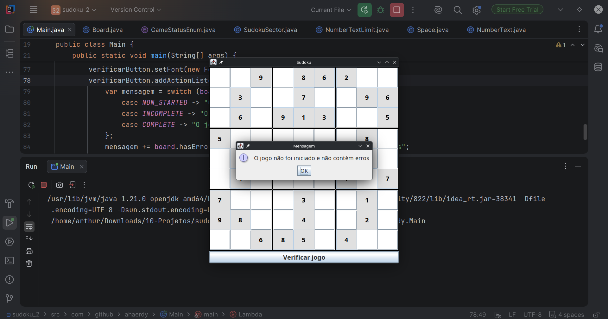
</p>

### Esquema de Implementsação

<p align="center">
  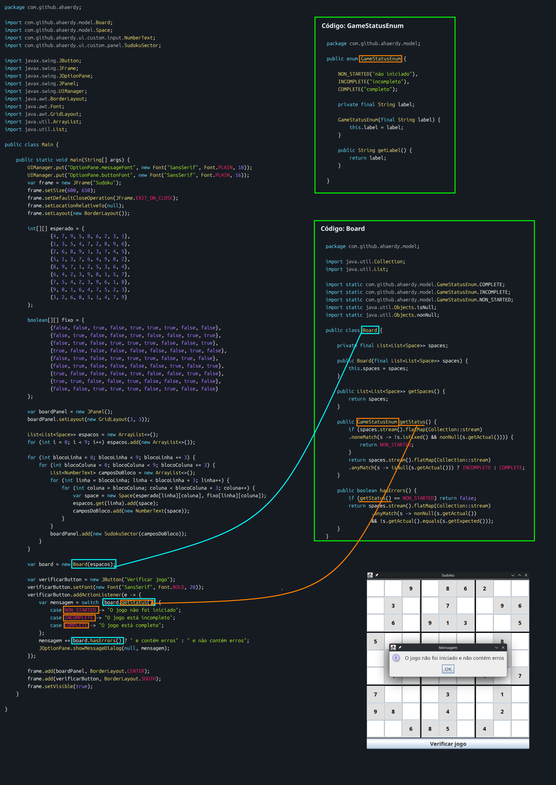
</p>

---

## Parte 9: Botões de Reiniciar e Concluir

**Data:** 13/09/2026

### Objetivo

Completar o conjunto de ações do jogo, adicionando os botões "Reiniciar jogo" e "Concluir". Com `Board` já extraído na etapa anterior, cada nova ação exige apenas um método novo na classe de domínio e um botão que o consuma — sem repetir laços de varredura manual.

### Implementação Realizada

- Adição de dois métodos à classe `Board`: `reset()`, que limpa todas as células não fixas, e `gameIsFinished()`, que combina ausência de erros e status completo em uma única verificação.
- Criação do botão "Reiniciar jogo", com confirmação prévia via `JOptionPane.showConfirmDialog`, disparando `board.reset()` apenas em caso de resposta afirmativa.
- Criação do botão "Concluir", que consulta `board.gameIsFinished()` e exibe uma mensagem de sucesso ou de pendência, conforme o resultado.
- Substituição da região inferior da janela (`BorderLayout.SOUTH`), que continha apenas o botão de verificação, por um novo painel (`botoesPanel`) agrupando os três botões lado a lado.

Implementação seguiu integralmente a estrutura de referência adotada para este projeto, sem alterações. Os três botões e a caixa de confirmação de reinício se comportaram conforme o esperado nos testes realizados.

### Código: Métodos Adicionados a Board

```java
    public void reset() {
        spaces.forEach(c -> c.forEach(Space::clearSpace));
    }

    public boolean gameIsFinished() {
        return !hasErrors() && getStatus().equals(GameStatusEnum.COMPLETE);
    }
```

### Código: Botões de Reiniciar e Concluir

```java
        var resetButton = new JButton("Reiniciar jogo");
        resetButton.setFont(new Font("SansSerif", Font.BOLD, 20));
        resetButton.addActionListener(e -> {
            var resposta = JOptionPane.showConfirmDialog(
                    null, "Deseja realmente reiniciar o jogo?", "Confirmar", JOptionPane.YES_NO_OPTION);
            if (resposta == 0) {
                board.reset();
            }
        });

        var finalizarButton = new JButton("Concluir");
        finalizarButton.setFont(new Font("SansSerif", Font.BOLD, 20));
        finalizarButton.addActionListener(e -> {
            if (board.gameIsFinished()) {
                JOptionPane.showMessageDialog(null, "Parabéns, você concluiu o jogo!");
            } else {
                JOptionPane.showMessageDialog(null, "Seu jogo ainda não está correto ou completo.");
            }
        });

        var botoesPanel = new JPanel();
        botoesPanel.add(verificarButton);
        botoesPanel.add(resetButton);
        botoesPanel.add(finalizarButton);

        frame.add(boardPanel, BorderLayout.CENTER);
        frame.add(botoesPanel, BorderLayout.SOUTH);
```

A linha `frame.add(verificarButton, BorderLayout.SOUTH);`, existente desde a Parte 7, foi substituída pelas duas últimas linhas acima.

### Descrição Técnica

#### Destaque: `Board.reset()`

```java
public void reset() {
    spaces.forEach(c -> c.forEach(Space::clearSpace));
}
```

Dois `forEach` encadeados, equivalentes a dois laços `for` aninhados escritos de forma funcional. O `forEach` externo percorre `spaces` (a lista de listas); para cada lista interna `c` (uma linha inteira de células), `c.forEach(Space::clearSpace)` executa `clearSpace()` em cada `Space` daquela linha. Como `clearSpace()` já respeita a regra de célula fixa (definida em `Space.setActual()`, na Parte 4), este `reset()` nunca apaga as dicas — apenas os valores preenchidos pelo jogador.

#### Destaque: `Board.gameIsFinished()`

```java
public boolean gameIsFinished() {
    return !hasErrors() && getStatus().equals(GameStatusEnum.COMPLETE);
}
```

O jogo só é considerado vencido quando duas condições são verdadeiras simultaneamente: ausência de erros e status completo. O operador `&&` (E lógico) garante isso — se qualquer uma das duas condições falhar, o resultado é `false`.

#### Destaque: confirmação antes de reiniciar

```java
var resposta = JOptionPane.showConfirmDialog(
        null, "Deseja realmente reiniciar o jogo?", "Confirmar", JOptionPane.YES_NO_OPTION);
if (resposta == 0) {
    board.reset();
}
```

`JOptionPane.showConfirmDialog` abre uma caixa de diálogo modal (bloqueia a interação com o restante da janela até ser respondida), com duas opções, "Sim" e "Não" (`JOptionPane.YES_NO_OPTION`). O primeiro argumento (`null`) é o componente "pai" do diálogo, deixando o próprio sistema decidir seu posicionamento; o segundo é a pergunta exibida; o terceiro, o título da janela do diálogo. O retorno é um número inteiro representando a opção escolhida — `0` é uma convenção do próprio `JOptionPane` para a primeira opção ("Sim"). Apenas nesse caso `board.reset()` é chamado, evitando perda de progresso por clique acidental.

#### Destaque: `botoesPanel` e o layout padrão de `JPanel`

```java
var botoesPanel = new JPanel();
botoesPanel.add(verificarButton);
botoesPanel.add(resetButton);
botoesPanel.add(finalizarButton);
```

Este painel é criado sem qualquer chamada a `setLayout`, o que significa que utiliza o layout padrão de um `JPanel`: `FlowLayout`, que organiza os componentes filhos em sequência, da esquerda para a direita, quebrando linha quando necessário. É este painel — e não os três botões individualmente — que ocupa a região `BorderLayout.SOUTH` da janela.

### Glossário

| Termo | Significado |
|---|---|
| **`forEach`** | Método que executa uma ação para cada elemento de uma coleção, sem a necessidade de um `for` explícito. |
| **`&&` (E lógico)** | Operador que retorna `true` somente se ambas as condições ao seu redor forem verdadeiras. |
| **`JOptionPane.showConfirmDialog`** | Exibe uma caixa de diálogo com opções (neste caso, "Sim"/"Não"), retornando um código correspondente à escolha (`0` para a primeira opção). |
| **Diálogo modal** | Janela que bloqueia a interação com o restante da aplicação até ser respondida ou fechada. |
| **`FlowLayout`** (layout padrão de `JPanel`) | Organiza os componentes filhos em sequência, da esquerda para a direita, quebrando linha quando necessário. |

### Código: Board Completo

```java
package com.github.ahaerdy.model;

import java.util.Collection;
import java.util.List;

import static com.github.ahaerdy.model.GameStatusEnum.COMPLETE;
import static com.github.ahaerdy.model.GameStatusEnum.INCOMPLETE;
import static com.github.ahaerdy.model.GameStatusEnum.NON_STARTED;
import static java.util.Objects.isNull;
import static java.util.Objects.nonNull;

public class Board {

    private final List<List<Space>> spaces;

    public Board(final List<List<Space>> spaces) {
        this.spaces = spaces;
    }

    public List<List<Space>> getSpaces() {
        return spaces;
    }

    public GameStatusEnum getStatus() {
        if (spaces.stream().flatMap(Collection::stream)
        .noneMatch(s -> !s.isFixed() && nonNull(s.getActual()))) {
            return NON_STARTED;
        }
        return spaces.stream().flatMap(Collection::stream)
        .anyMatch(s -> isNull(s.getActual())) ? INCOMPLETE : COMPLETE;
    }

    public boolean hasErrors() {
        if (getStatus() == NON_STARTED) return false;
        return spaces.stream().flatMap(Collection::stream)
                .anyMatch(s -> nonNull(s.getActual()) && !s.getActual().equals(s.getExpected()));
    }

    public void reset() {
        spaces.forEach(c -> c.forEach(Space::clearSpace));
    }

    public boolean gameIsFinished() {
        return !hasErrors() && getStatus().equals(GameStatusEnum.COMPLETE);
    }

}
```

### Código: Main Completo

Estado integral do arquivo `Main.java` ao final desta etapa:

```java
package com.github.ahaerdy;

import com.github.ahaerdy.model.Board;
import com.github.ahaerdy.model.Space;
import com.github.ahaerdy.ui.custom.input.NumberText;
import com.github.ahaerdy.ui.custom.panel.SudokuSector;

import javax.swing.JButton;
import javax.swing.JFrame;
import javax.swing.JOptionPane;
import javax.swing.JPanel;
import javax.swing.UIManager;
import java.awt.BorderLayout;
import java.awt.Font;
import java.awt.GridLayout;
import java.util.ArrayList;
import java.util.List;

public class Main {

    public static void main(String[] args) {
        UIManager.put("OptionPane.messageFont", new Font("SansSerif", Font.PLAIN, 18));
        UIManager.put("OptionPane.buttonFont", new Font("SansSerif", Font.PLAIN, 16));
        var frame = new JFrame("Sudoku");
        frame.setSize(600, 650);
        frame.setDefaultCloseOperation(JFrame.EXIT_ON_CLOSE);
        frame.setLocationRelativeTo(null);
        frame.setLayout(new BorderLayout());

        int[][] esperado = {
                {4, 7, 9, 5, 8, 6, 2, 3, 1},
                {1, 3, 5, 4, 7, 2, 8, 9, 6},
                {2, 6, 8, 9, 1, 3, 7, 4, 5},
                {5, 1, 3, 7, 6, 4, 9, 8, 2},
                {8, 9, 7, 1, 2, 5, 3, 6, 4},
                {6, 4, 2, 3, 9, 8, 1, 5, 7},
                {7, 5, 4, 2, 3, 9, 6, 1, 8},
                {9, 8, 1, 6, 4, 7, 5, 2, 3},
                {3, 2, 6, 8, 5, 1, 4, 7, 9}
        };

        boolean[][] fixo = {
                {false, false, true, false, true, true, true, false, false},
                {false, true, false, false, true, false, false, true, true},
                {false, true, false, true, true, true, false, false, true},
                {true, false, false, false, false, false, false, true, false},
                {false, true, false, true, true, true, false, true, false},
                {false, true, false, false, false, false, true, false, true},
                {true, false, false, false, true, false, false, true, false},
                {true, true, false, false, true, false, false, true, false},
                {false, false, true, true, true, false, true, false, false}
        };

        var boardPanel = new JPanel();
        boardPanel.setLayout(new GridLayout(3, 3));

        List<List<Space>> espacos = new ArrayList<>();
        for (int i = 0; i < 9; i++) espacos.add(new ArrayList<>());

        for (int blocoLinha = 0; blocoLinha < 9; blocoLinha += 3) {
            for (int blocoColuna = 0; blocoColuna < 9; blocoColuna += 3) {
                List<NumberText> camposDoBloco = new ArrayList<>();
                for (int linha = blocoLinha; linha < blocoLinha + 3; linha++) {
                    for (int coluna = blocoColuna; coluna < blocoColuna + 3; coluna++) {
                        var space = new Space(esperado[linha][coluna], fixo[linha][coluna]);
                        espacos.get(linha).add(space);
                        camposDoBloco.add(new NumberText(space));
                    }
                }
                boardPanel.add(new SudokuSector(camposDoBloco));
            }
        }

        var board = new Board(espacos);

        var verificarButton = new JButton("Verificar jogo");
        verificarButton.setFont(new Font("SansSerif", Font.BOLD, 20));
        verificarButton.addActionListener(e -> {
            var mensagem = switch (board.getStatus()) {
                case NON_STARTED -> "O jogo não foi iniciado";
                case INCOMPLETE -> "O jogo está incompleto";
                case COMPLETE -> "O jogo está completo";
            };
            mensagem += board.hasErrors() ? " e contém erros" : " e não contém erros";
            JOptionPane.showMessageDialog(null, mensagem);
        });

        var resetButton = new JButton("Reiniciar jogo");
        resetButton.setFont(new Font("SansSerif", Font.BOLD, 20));
        resetButton.addActionListener(e -> {
            var resposta = JOptionPane.showConfirmDialog(
                    null, "Deseja realmente reiniciar o jogo?", "Confirmar", JOptionPane.YES_NO_OPTION);
            if (resposta == 0) {
                board.reset();
            }
        });

        var finalizarButton = new JButton("Concluir");
        finalizarButton.setFont(new Font("SansSerif", Font.BOLD, 20));
        finalizarButton.addActionListener(e -> {
            if (board.gameIsFinished()) {
                JOptionPane.showMessageDialog(null, "Parabéns, você concluiu o jogo!");
            } else {
                JOptionPane.showMessageDialog(null, "Seu jogo ainda não está correto ou completo.");
            }
        });

        var botoesPanel = new JPanel();
        botoesPanel.add(verificarButton);
        botoesPanel.add(resetButton);
        botoesPanel.add(finalizarButton);

        frame.add(boardPanel, BorderLayout.CENTER);
        frame.add(botoesPanel, BorderLayout.SOUTH);
        frame.setVisible(true);
    }

}
```

### Resultado

Execução de `Main` concluída com sucesso: os três botões passaram a ser exibidos lado a lado na região inferior da janela, todos com a mesma fonte ampliada em negrito. O botão "Concluir", testado antes da finalização do tabuleiro, exibiu corretamente o aviso de pendência. O botão "Reiniciar jogo" exibiu a caixa de confirmação como esperado e, ao confirmar, os dados internos do jogo foram efetivamente limpos.

Observação registrada para a próxima etapa: ao reiniciar, os valores digitados pelo jogador permanecem visíveis na tela, mesmo após a confirmação — o estado interno (`Space`) é limpo, mas os campos visuais (`NumberText`) não são notificados dessa mudança. Esse comportamento é esperado neste ponto do projeto e será tratado na Parte 10.

<p align="center">
  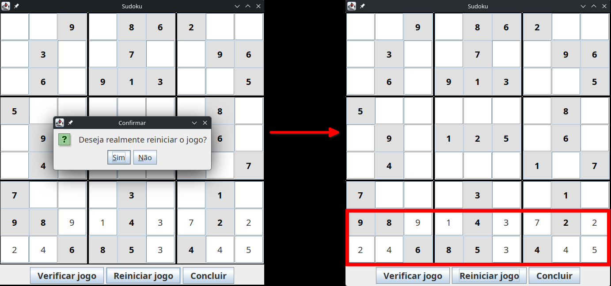
</p>

### Esquema de Implementação

<p align="center">
  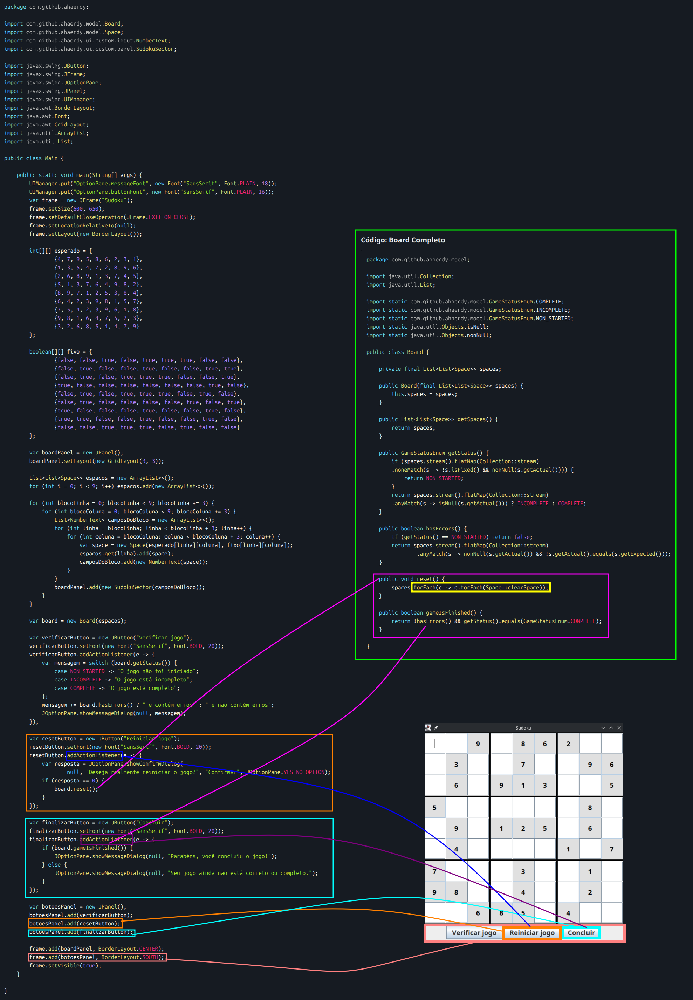
</p>

---

## Parte 10: Sincronização entre Tela e Domínio (Padrão Observer)

**Data:** 13/09/2026

### Objetivo

Corrigir a divergência observada ao final da Parte 9: `board.reset()` limpa corretamente os objetos `Space` internamente, mas nenhum `NumberText` é avisado dessa mudança, permanecendo com o valor antigo visível na tela. A causa é estrutural — cada `NumberText` atualiza o `Space` quando o próprio usuário digita (via `DocumentListener`), mas não existe nenhum caminho inverso, do `Space` de volta para o `NumberText`.

### Implementação Realizada

- Criação do pacote `com.github.ahaerdy.service` com três novos arquivos: `EventEnum`, `EventListener` e `NotifierService`, implementando o padrão de projeto Observer (aqui nomeado *Notifier*).
- Alteração da classe `NumberText` para implementar a interface `EventListener`, adicionando o método `update`.
- Criação de um `NotifierService` em `Main`, com inscrição de cada `NumberText` no momento de sua criação e disparo do evento de limpeza dentro do `ActionListener` do botão "Reiniciar jogo".

Implementação seguiu integralmente a estrutura de referência adotada para este projeto, sem alterações. Teste realizado: preenchimento de células livres, clique em "Reiniciar jogo" e confirmação via "Confirmar" no diálogo "Deseja realmente reiniciar o jogo?" — o tabuleiro foi corretamente limpo ao final, com as células fixas permanecendo intactas.

### Código: EventEnum

```java
package com.github.ahaerdy.service;

public enum EventEnum {
    CLEAR_SPACE
}
```

### Código: EventListener

```java
package com.github.ahaerdy.service;

public interface EventListener {
    void update(final EventEnum eventType);
}
```

### Código: NotifierService

```java
package com.github.ahaerdy.service;

import java.util.ArrayList;
import java.util.HashMap;
import java.util.List;
import java.util.Map;

import static com.github.ahaerdy.service.EventEnum.CLEAR_SPACE;

public class NotifierService {

    private final Map<EventEnum, List<EventListener>> listeners = new HashMap<>() {{
        put(CLEAR_SPACE, new ArrayList<>());
    }};

    public void subscribe(final EventEnum eventType, final EventListener listener) {
        listeners.get(eventType).add(listener);
    }

    public void notify(final EventEnum eventType) {
        listeners.get(eventType).forEach(l -> l.update(eventType));
    }

}
```

### Descrição Técnica

- `EventEnum` representa os tipos de evento que podem ser disparados pelo sistema; por ora, um único valor (`CLEAR_SPACE`).
- `EventListener` é uma interface de um único método, implementada por qualquer classe que precise reagir a um evento disparado.
- `NotifierService` concentra a lógica de inscrição e disparo, mantendo, para cada tipo de evento, uma lista dos interessados em ser avisados.

#### Destaque: a estrutura interna de `NotifierService`

```java
private final Map<EventEnum, List<EventListener>> listeners = new HashMap<>() {{
    put(CLEAR_SPACE, new ArrayList<>());
}};

public void subscribe(final EventEnum eventType, final EventListener listener) {
    listeners.get(eventType).add(listener);
}

public void notify(final EventEnum eventType) {
    listeners.get(eventType).forEach(l -> l.update(eventType));
}
```

- `Map<EventEnum, List<EventListener>>` associa cada tipo de evento a uma lista de interessados.
- `new HashMap<>() {{ put(CLEAR_SPACE, new ArrayList<>()); }}` é uma inicialização por bloco de instância (informalmente chamada *double brace initialization*): cria o `HashMap` e, no mesmo momento, executa um bloco que já registra uma lista vazia para `CLEAR_SPACE`. Equivale a criar o mapa e, em seguida, chamar `listeners.put(CLEAR_SPACE, new ArrayList<>())`.
- `subscribe(eventType, listener)` localiza a lista correspondente ao evento e adiciona o novo `listener`.
- `notify(eventType)` percorre todos os inscritos daquele evento e invoca `update(eventType)` em cada um.

#### Destaque: `NumberText` como `EventListener`

```java
public class NumberText extends JTextField implements EventListener {
```

```java
@Override
public void update(final EventEnum eventType) {
    if (eventType.equals(EventEnum.CLEAR_SPACE) && this.isEditable()) {
        this.setText("");
    }
}
```

Ao receber uma notificação, o método verifica duas condições: se o evento é `CLEAR_SPACE` e se o campo está editável (`this.isEditable()`). O uso de `isEditable()`, e não `isEnabled()`, é deliberado: desde a Parte 5, as células fixas são marcadas com `setEditable(false)`, nunca `setEnabled(false)`. Caso este método verificasse `isEnabled()`, a condição seria sempre verdadeira (nenhum campo é desabilitado neste projeto), e o reinício apagaria também os valores fixos — um bug novo e sutil. `this.setText("")` limpa o campo visualmente e, por dispará o `DocumentListener` já existente desde a Parte 5 (`removeUpdate`), garante que `space.clearSpace()` também seja chamado — mantendo tela e domínio sincronizados por um único caminho.

#### Destaque: inscrição e disparo em `Main`

```java
var notifierService = new NotifierService();

// dentro do laço de criação dos campos, logo após criar cada NumberText:
var campo = new NumberText(space);
notifierService.subscribe(EventEnum.CLEAR_SPACE, campo);
camposDoBloco.add(campo);
```

```java
resetButton.addActionListener(e -> {
    var resposta = JOptionPane.showConfirmDialog(
            null, "Deseja realmente reiniciar o jogo?", "Confirmar", JOptionPane.YES_NO_OPTION);
    if (resposta == 0) {
        board.reset();
        notifierService.notify(EventEnum.CLEAR_SPACE);
    }
});
```

Como `NumberText` passou a implementar `EventListener`, cada instância pode ser passada diretamente como segundo argumento de `subscribe` — as 81 células se inscrevem no evento `CLEAR_SPACE` assim que são criadas. A única linha nova dentro do `resetButton` é `notifierService.notify(EventEnum.CLEAR_SPACE);`, chamada imediatamente após `board.reset()`.

#### Fluxo completo, do clique à tela limpa

1. Jogador clica em "Reiniciar jogo" e confirma no diálogo.
2. `board.reset()` limpa todos os `Space` não fixos — lógica pura de domínio, sem qualquer relação com a interface.
3. `notifierService.notify(EventEnum.CLEAR_SPACE)` percorre os 81 `NumberText` inscritos e chama `update(CLEAR_SPACE)` em cada um.
4. Cada `NumberText`, ao receber a notificação, verifica se está editável e, em caso afirmativo, chama `setText("")`.
5. Resultado: a interface reflete o novo estado do jogo, sem que `Board` precise conhecer `JTextField`, Swing, ou qualquer detalhe de interface gráfica.

### Glossário

| Termo | Significado |
|---|---|
| **Padrão Observer / Notifier** | Padrão de projeto em que objetos ("observadores") se inscrevem para serem notificados quando outro objeto sofre uma mudança de estado. |
| **`implements`** | Palavra-chave que indica que uma classe fornece uma implementação concreta dos métodos de uma interface. |
| **`HashMap`** | Implementação mais comum da interface `Map`, usada aqui para associar cada tipo de evento à sua lista de inscritos. |
| **Inscrição (subscribe) / Disparo (notify)** | Respectivamente, o ato de registrar interesse em um evento e o ato de avisar todos os inscritos de que o evento ocorreu. |

### Código: NumberText Completo

Estado integral do arquivo `NumberText.java` ao final desta etapa:

```java
package com.github.ahaerdy.ui.custom.input;

import com.github.ahaerdy.model.Space;
import com.github.ahaerdy.service.EventEnum;
import com.github.ahaerdy.service.EventListener;

import javax.swing.JTextField;
import javax.swing.event.DocumentEvent;
import javax.swing.event.DocumentListener;
import java.awt.Color;
import java.awt.Dimension;
import java.awt.Font;

public class NumberText extends JTextField implements EventListener {

    private final Space space;

    public NumberText(final Space space) {
        this.space = space;
        var dimension = new Dimension(50, 50);
        this.setSize(dimension);
        this.setPreferredSize(dimension);
        this.setVisible(true);
        this.setHorizontalAlignment(CENTER);
        this.setDocument(new NumberTextLimit());
        this.setEditable(!space.isFixed());
        if (space.isFixed()) {
            this.setText(space.getActual().toString());
            this.setFont(new Font("Arial", Font.BOLD, 20));
            this.setBackground(new Color(224, 224, 224));
            this.setForeground(Color.BLACK);
        } else {
            this.setFont(new Font("Arial", Font.PLAIN, 20));
        }
        this.getDocument().addDocumentListener(new DocumentListener() {

            @Override
            public void insertUpdate(final DocumentEvent e) {
                changeSpace();
            }

            @Override
            public void removeUpdate(final DocumentEvent e) {
                changeSpace();
            }

            @Override
            public void changedUpdate(final DocumentEvent e) {
                changeSpace();
            }

            private void changeSpace() {
                if (getText().isEmpty()) {
                    space.clearSpace();
                    return;
                }
                space.setActual(Integer.parseInt(getText()));
            }

        });
    }

    @Override
    public void update(final EventEnum eventType) {
        if (eventType.equals(EventEnum.CLEAR_SPACE) && this.isEditable()) {
            this.setText("");
        }
    }
}
```

### Código: Main Completo

Estado integral do arquivo `Main.java` ao final desta etapa:

```java
package com.github.ahaerdy;

import com.github.ahaerdy.model.Board;
import com.github.ahaerdy.model.Space;
import com.github.ahaerdy.service.EventEnum;
import com.github.ahaerdy.service.NotifierService;
import com.github.ahaerdy.ui.custom.input.NumberText;
import com.github.ahaerdy.ui.custom.panel.SudokuSector;

import javax.swing.JButton;
import javax.swing.JFrame;
import javax.swing.JOptionPane;
import javax.swing.JPanel;
import javax.swing.UIManager;
import java.awt.BorderLayout;
import java.awt.Font;
import java.awt.GridLayout;
import java.util.ArrayList;
import java.util.List;

public class Main {

    public static void main(String[] args) {
        UIManager.put("OptionPane.messageFont", new Font("SansSerif", Font.PLAIN, 18));
        UIManager.put("OptionPane.buttonFont", new Font("SansSerif", Font.PLAIN, 16));
        var frame = new JFrame("Sudoku");
        frame.setSize(600, 650);
        frame.setDefaultCloseOperation(JFrame.EXIT_ON_CLOSE);
        frame.setLocationRelativeTo(null);
        frame.setLayout(new BorderLayout());

        int[][] esperado = {
                {4, 7, 9, 5, 8, 6, 2, 3, 1},
                {1, 3, 5, 4, 7, 2, 8, 9, 6},
                {2, 6, 8, 9, 1, 3, 7, 4, 5},
                {5, 1, 3, 7, 6, 4, 9, 8, 2},
                {8, 9, 7, 1, 2, 5, 3, 6, 4},
                {6, 4, 2, 3, 9, 8, 1, 5, 7},
                {7, 5, 4, 2, 3, 9, 6, 1, 8},
                {9, 8, 1, 6, 4, 7, 5, 2, 3},
                {3, 2, 6, 8, 5, 1, 4, 7, 9}
        };

        boolean[][] fixo = {
                {false, false, true, false, true, true, true, false, false},
                {false, true, false, false, true, false, false, true, true},
                {false, true, false, true, true, true, false, false, true},
                {true, false, false, false, false, false, false, true, false},
                {false, true, false, true, true, true, false, true, false},
                {false, true, false, false, false, false, true, false, true},
                {true, false, false, false, true, false, false, true, false},
                {true, true, false, false, true, false, false, true, false},
                {false, false, true, true, true, false, true, false, false}
        };

        var boardPanel = new JPanel();
        boardPanel.setLayout(new GridLayout(3, 3));

        List<List<Space>> espacos = new ArrayList<>();
        for (int i = 0; i < 9; i++) espacos.add(new ArrayList<>());

        var notifierService = new NotifierService();

        for (int blocoLinha = 0; blocoLinha < 9; blocoLinha += 3) {
            for (int blocoColuna = 0; blocoColuna < 9; blocoColuna += 3) {
                List<NumberText> camposDoBloco = new ArrayList<>();
                for (int linha = blocoLinha; linha < blocoLinha + 3; linha++) {
                    for (int coluna = blocoColuna; coluna < blocoColuna + 3; coluna++) {
                        var space = new Space(esperado[linha][coluna], fixo[linha][coluna]);
                        espacos.get(linha).add(space);

                        var campo = new NumberText(space);
                        notifierService.subscribe(EventEnum.CLEAR_SPACE, campo);
                        camposDoBloco.add(campo);
                    }
                }
                boardPanel.add(new SudokuSector(camposDoBloco));
            }
        }

        var board = new Board(espacos);

        var verificarButton = new JButton("Verificar jogo");
        verificarButton.setFont(new Font("SansSerif", Font.BOLD, 20));
        verificarButton.addActionListener(e -> {
            var mensagem = switch (board.getStatus()) {
                case NON_STARTED -> "O jogo não foi iniciado";
                case INCOMPLETE -> "O jogo está incompleto";
                case COMPLETE -> "O jogo está completo";
            };
            mensagem += board.hasErrors() ? " e contém erros" : " e não contém erros";
            JOptionPane.showMessageDialog(null, mensagem);
        });

        var resetButton = new JButton("Reiniciar jogo");
        resetButton.setFont(new Font("SansSerif", Font.BOLD, 20));
        resetButton.addActionListener(e -> {
            var resposta = JOptionPane.showConfirmDialog(
                    null, "Deseja realmente reiniciar o jogo?", "Confirmar", JOptionPane.YES_NO_OPTION);
            if (resposta == 0) {
                board.reset();
                notifierService.notify(EventEnum.CLEAR_SPACE);
            }
        });

        var finalizarButton = new JButton("Concluir");
        finalizarButton.setFont(new Font("SansSerif", Font.BOLD, 20));
        finalizarButton.addActionListener(e -> {
            if (board.gameIsFinished()) {
                JOptionPane.showMessageDialog(null, "Parabéns, você concluiu o jogo!");
            } else {
                JOptionPane.showMessageDialog(null, "Seu jogo ainda não está correto ou completo.");
            }
        });

        var botoesPanel = new JPanel();
        botoesPanel.add(verificarButton);
        botoesPanel.add(resetButton);
        botoesPanel.add(finalizarButton);

        frame.add(boardPanel, BorderLayout.CENTER);
        frame.add(botoesPanel, BorderLayout.SOUTH);
        frame.setVisible(true);
    }

}
```

### Resultado

Execução de `Main` concluída com sucesso: ao preencher células livres e clicar em "Reiniciar jogo", confirmando no diálogo "Deseja realmente reiniciar o jogo?", o tabuleiro foi corretamente limpo — as células editáveis voltaram ao estado vazio, enquanto as células fixas permaneceram intactas, em negrito sobre fundo cinza. A divergência entre estado interno e exibição visual, observada ao final da Parte 9, foi eliminada.

<p align="center">
  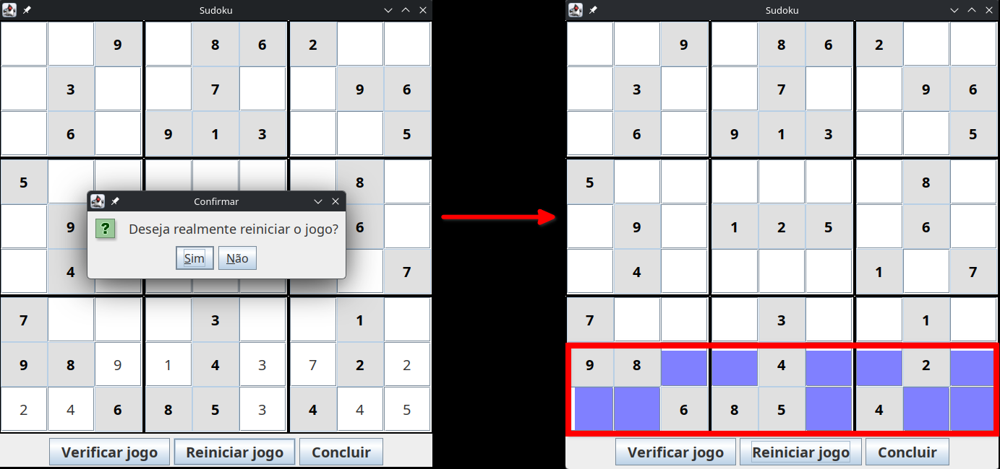
</p>

### Esquema de Implementação

<p align="center">
  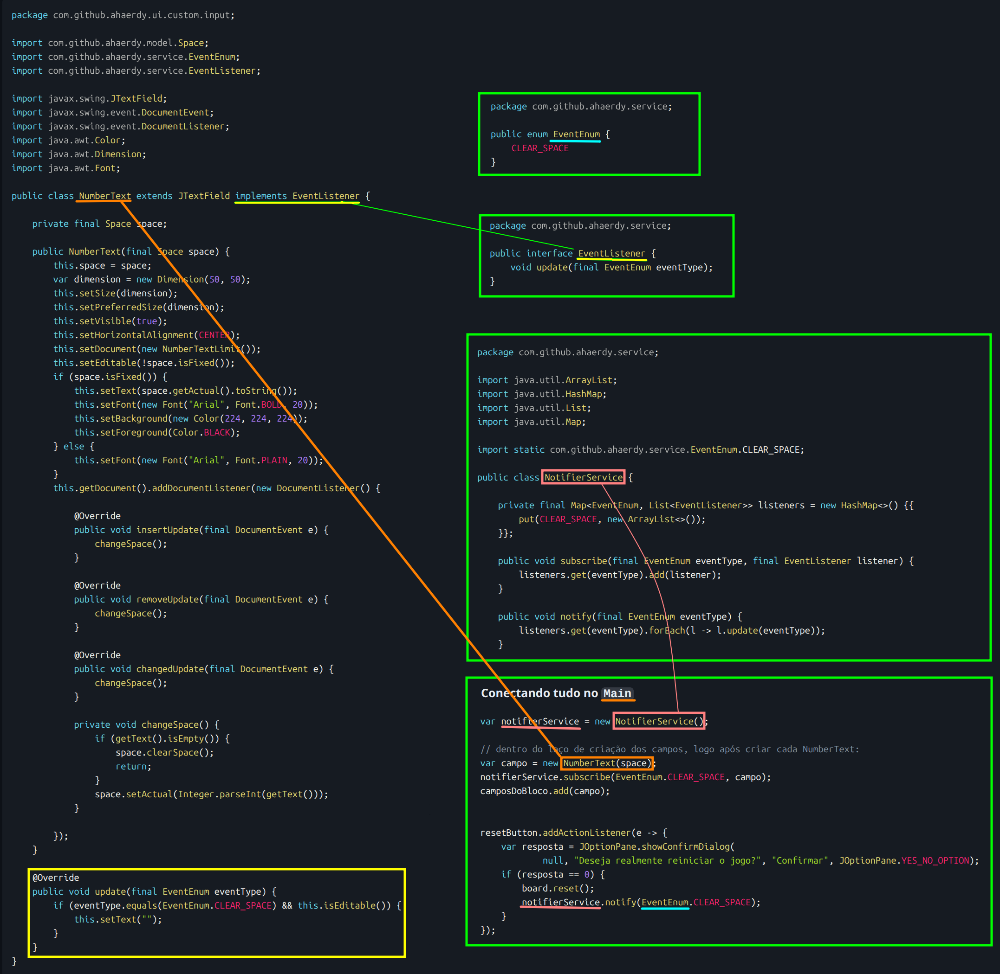
</p>

---

## Parte 11: Configuração do Tabuleiro via Arquivo Externo

**Data:** 14/09/2026

### Objetivo

Eliminar a dependência de matrizes de configuração fixas no código-fonte (`esperado[][]`, `fixo[][]`), permitindo que o Sudoku exibido seja definido externamente, sem necessidade de recompilação. A abordagem inicialmente cogitada — repassar as 81 posições diretamente como argumentos de linha de comando — foi descartada em favor da leitura de um arquivo de texto, por três razões práticas: um argumento com 81 tokens é de difícil edição dentro do campo de configuração do IntelliJ, não pode ser aberto em um editor de texto convencional, e não se presta a versionamento junto do restante do projeto.

### Implementação Realizada

- Substituição da leitura de 81 argumentos de linha de comando por um único argumento, correspondente ao nome (ou caminho) de um arquivo `.txt` contendo a mesma configuração.
- Criação do arquivo `sudoku.txt`, com as 81 entradas no formato já estabelecido (`coluna,linha;valorEsperado,éFixo`).
- Leitura do arquivo via `Files.readString(Path.of(args[0]))`, com o conteúdo subsequentemente dividido nos mesmos 81 tokens antes utilizados diretamente a partir de `args`.
- Ajuste da assinatura do método `main` para declarar `throws IOException`, dado que a leitura de arquivo é uma operação sujeita a falha (arquivo inexistente, permissão insuficiente, etc.).
- Reconfiguração da Run Configuration correspondente no IntelliJ (renomeada para "Sudoku - Gráfico"), informando apenas o nome do arquivo no campo **Program arguments**.

Implementação seguiu integralmente a estrutura de referência adotada para este projeto, sem alterações. Teste realizado: execução de `Main` com o argumento de arquivo configurado — o tabuleiro foi corretamente carregado, com as posições fixas exibindo os respectivos números conforme o conteúdo de `sudoku.txt`.

### Código: Main com Leitura de Arquivo

```java
package com.github.ahaerdy;

import com.github.ahaerdy.model.Board;
import com.github.ahaerdy.model.Space;
import com.github.ahaerdy.service.EventEnum;
import com.github.ahaerdy.service.NotifierService;
import com.github.ahaerdy.ui.custom.input.NumberText;
import com.github.ahaerdy.ui.custom.panel.SudokuSector;

import javax.swing.JButton;
import javax.swing.JFrame;
import javax.swing.JOptionPane;
import javax.swing.JPanel;
import javax.swing.UIManager;
import java.awt.BorderLayout;
import java.awt.Font;
import java.awt.GridLayout;
import java.io.IOException;
import java.nio.file.Files;
import java.nio.file.Path;
import java.util.ArrayList;
import java.util.List;
import java.util.stream.Stream;

import static java.util.stream.Collectors.toMap;

public class Main {

    public static void main(String[] args) throws IOException {
        UIManager.put("OptionPane.messageFont", new Font("SansSerif", Font.PLAIN, 18));
        UIManager.put("OptionPane.buttonFont", new Font("SansSerif", Font.PLAIN, 16));

        var conteudoArquivo = Files.readString(Path.of(args[0]));
        final var gameConfig = Stream.of(conteudoArquivo.trim().split("\\s+"))
                .collect(toMap(k -> k.split(";")[0], v -> v.split(";")[1]));

        var frame = new JFrame("Sudoku");
        frame.setSize(600, 650);
        frame.setDefaultCloseOperation(JFrame.EXIT_ON_CLOSE);
        frame.setLocationRelativeTo(null);
        frame.setLayout(new BorderLayout());

        var boardPanel = new JPanel();
        boardPanel.setLayout(new GridLayout(3, 3));

        List<List<Space>> espacos = new ArrayList<>();
        for (int i = 0; i < 9; i++) espacos.add(new ArrayList<>());

        var notifierService = new NotifierService();

        for (int blocoLinha = 0; blocoLinha < 9; blocoLinha += 3) {
            for (int blocoColuna = 0; blocoColuna < 9; blocoColuna += 3) {
                List<NumberText> camposDoBloco = new ArrayList<>();
                for (int linha = blocoLinha; linha < blocoLinha + 3; linha++) {
                    for (int coluna = blocoColuna; coluna < blocoColuna + 3; coluna++) {
                        var positionConfig = gameConfig.get("%s,%s".formatted(linha, coluna));
                        var expected = Integer.parseInt(positionConfig.split(",")[0]);
                        var fixed = Boolean.parseBoolean(positionConfig.split(",")[1]);
                        var space = new Space(expected, fixed);
                        espacos.get(linha).add(space);

                        var campo = new NumberText(space);
                        notifierService.subscribe(EventEnum.CLEAR_SPACE, campo);
                        camposDoBloco.add(campo);
                    }
                }
                boardPanel.add(new SudokuSector(camposDoBloco));
            }
        }

        var board = new Board(espacos);

        var verificarButton = new JButton("Verificar jogo");
        verificarButton.setFont(new Font("SansSerif", Font.BOLD, 20));
        verificarButton.addActionListener(e -> {
            var mensagem = switch (board.getStatus()) {
                case NON_STARTED -> "O jogo não foi iniciado";
                case INCOMPLETE -> "O jogo está incompleto";
                case COMPLETE -> "O jogo está completo";
            };
            mensagem += board.hasErrors() ? " e contém erros" : " e não contém erros";
            JOptionPane.showMessageDialog(null, mensagem);
        });

        var resetButton = new JButton("Reiniciar jogo");
        resetButton.setFont(new Font("SansSerif", Font.BOLD, 20));
        resetButton.addActionListener(e -> {
            var resposta = JOptionPane.showConfirmDialog(
                    null, "Deseja realmente reiniciar o jogo?", "Confirmar", JOptionPane.YES_NO_OPTION);
            if (resposta == 0) {
                board.reset();
                notifierService.notify(EventEnum.CLEAR_SPACE);
            }
        });

        var finalizarButton = new JButton("Concluir");
        finalizarButton.setFont(new Font("SansSerif", Font.BOLD, 20));
        finalizarButton.addActionListener(e -> {
            if (board.gameIsFinished()) {
                JOptionPane.showMessageDialog(null, "Parabéns, você concluiu o jogo!");
            } else {
                JOptionPane.showMessageDialog(null, "Seu jogo ainda não está correto ou completo.");
            }
        });

        var botoesPanel = new JPanel();
        botoesPanel.add(verificarButton);
        botoesPanel.add(resetButton);
        botoesPanel.add(finalizarButton);

        frame.add(boardPanel, BorderLayout.CENTER);
        frame.add(botoesPanel, BorderLayout.SOUTH);
        frame.setVisible(true);
    }

}
```

### Descrição Técnica

#### Destaque: leitura do arquivo e reconstrução dos tokens

```java
var conteudoArquivo = Files.readString(Path.of(args[0]));
final var gameConfig = Stream.of(conteudoArquivo.trim().split("\\s+"))
        .collect(toMap(k -> k.split(";")[0], v -> v.split(";")[1]));
```

- `args[0]` passou a conter um único valor: o nome (ou caminho) do arquivo de configuração, informado como argumento único do programa.
- `Path.of(args[0])` converte esse texto em um objeto `Path`, o tipo utilizado pela API de arquivos do Java (`java.nio.file`) para representar a localização de um arquivo no sistema.
- `Files.readString(...)` lê o conteúdo integral do arquivo, devolvendo-o como uma única `String`.
- `conteudoArquivo.trim().split("\\s+")` remove espaços/quebras de linha nas bordas do conteúdo lido e, em seguida, divide-o em qualquer sequência de caracteres de espaço em branco — o que inclui tanto espaços simples quanto quebras de linha, permitindo que o arquivo seja formatado em uma única linha ou distribuído em várias, sem alterar o resultado.
- O restante da expressão (`Stream.of(...).collect(toMap(...))`) permanece inalterado em relação à versão anterior baseada em `args` — apenas a origem do array de tokens mudou.

#### Destaque: tratamento da exceção de leitura

```java
public static void main(String[] args) throws IOException {
```

A leitura de um arquivo é uma operação sujeita a falhas externas ao controle do programa — arquivo inexistente, caminho incorreto, ausência de permissão de leitura. O Java exige que essa possibilidade seja tratada, seja por meio de um bloco `try/catch`, seja pela declaração `throws`, que repassa a responsabilidade de tratamento para quem invoca o método. Para esta fase do projeto, optou-se pela declaração `throws IOException` diretamente na assinatura do `main`: na ausência do arquivo, o programa encerra com a exceção correspondente impressa no console — comportamento considerado adequado para o estágio atual.

### Glossário

| Termo | Significado |
|---|---|
| **`Path`** | Tipo do pacote `java.nio.file` que representa a localização de um arquivo ou diretório no sistema de arquivos. |
| **`Files.readString(...)`** | Método utilitário que lê todo o conteúdo de um arquivo de texto e o devolve como uma única `String`. |
| **`throws` (em assinatura de método)** | Declara que o método pode lançar uma exceção verificada (*checked exception*), repassando a responsabilidade de tratamento para quem o invoca. |
| **`IOException`** | Exceção verificada que representa uma falha de entrada/saída, como um arquivo inexistente ou inacessível. |
| **`"\\s+"` (expressão regular)** | Padrão que corresponde a uma ou mais ocorrências de qualquer caractere de espaço em branco. |

### Resultado

Execução de `Main` concluída com sucesso: o tabuleiro foi corretamente carregado a partir do arquivo `sudoku.txt`, com as posições fixas exibindo os respectivos números, em negrito sobre fundo cinza, conforme o padrão estabelecido desde a Parte 5. O comportamento observado foi idêntico ao das etapas anteriores, confirmando que a alteração não introduziu nenhuma divergência funcional.

<p align="center">
  
</p>